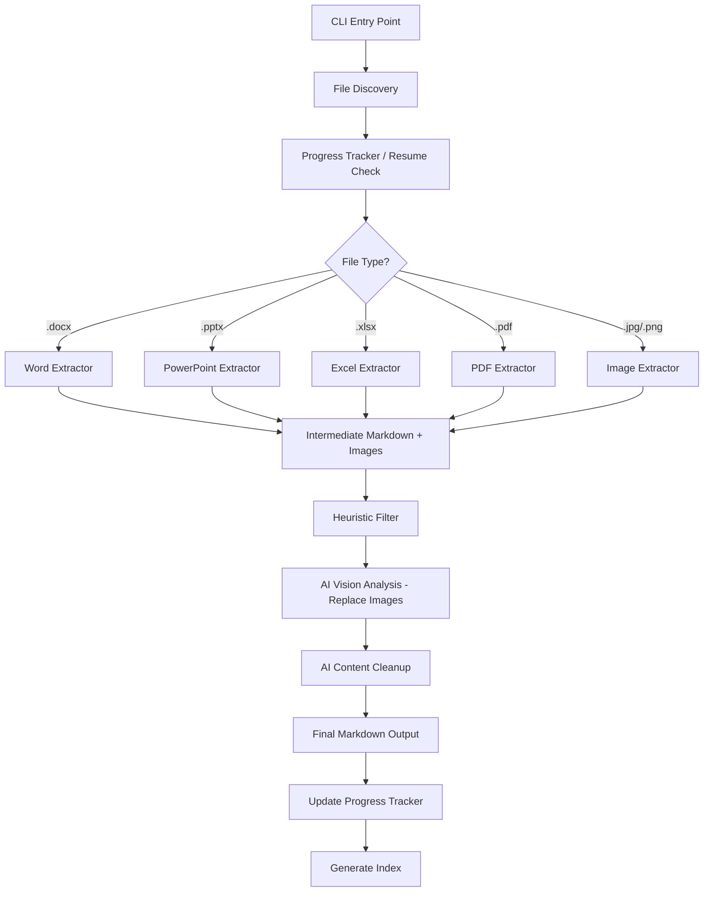

# Knowledge Extractor - Technical Specification

## Problem Statement

Build a Python CLI tool that extracts knowledge from a deep file tree (~280+ files: Word, PowerPoint, Excel, PDF, images) and produces clean, AI-agent-accessible Markdown files with a flat index. Graphics are converted to textual descriptions or Mermaid diagrams via OpenRouter vision API.

## Requirements

- Input: deep file tree with .docx, .pptx, .xlsx, .pdf, .jpg, .jpeg, .png (ignore other formats)
- Output: pure Markdown files (no images), flat `index.md` grouped by original folder structure
- Intermediate results: per-file markdown with embedded image references for debugging
- Content filtering: heuristic-based (skip title slides, repeated headers/logos) + AI judgment
- Image analysis: OpenRouter API with `google/gemini-2.5-flash` (default), base64-encoded images
- Incremental/resumable: track processed files, skip on re-run
- Sequential API calls (no concurrency)
- CLI with `--input`, `--output` (default `./output`), `--temp` (default `./temp`), `--model` flag
- Python 3.13, managed by UV

## Architecture



## Package Structure

```
src/knowledge_extractor/
├── __init__.py
├── cli.py              # CLI argument parsing (argparse)
├── discovery.py        # File tree walker, format filtering
├── tracker.py          # JSON-based progress/resume tracking
├── extractors/
│   ├── __init__.py
│   ├── docx_extractor.py   # Word documents
│   ├── pptx_extractor.py   # PowerPoint presentations
│   ├── excel_extractor.py  # Excel spreadsheets
│   ├── pdf_extractor.py    # PDF documents
│   └── image_extractor.py  # Standalone images
├── filters.py          # Heuristic content filtering
├── ai.py               # OpenRouter API client wrapper
├── pipeline.py         # Per-file processing orchestration
└── index.py            # Index file generation
```

## Dependencies

| Package | Purpose |
|---------|---------|
| `openrouter` | OpenRouter API SDK (vision + text) |
| `python-docx` | Word document extraction |
| `python-pptx` | PowerPoint extraction |
| `openpyxl` | Excel extraction |
| `pymupdf` | PDF text and image extraction |
| `Pillow` | Image handling and format conversion |

## Configuration

- **API Key**: `OPENROUTER_API_KEY` environment variable
- **Model**: `--model` CLI flag, default `google/gemini-2.5-flash`
- **Directories**: `--input` (required), `--output` (default `./output`), `--temp` (default `./temp`)

## Task Breakdown

### Task 1: Project scaffolding and CLI skeleton

**Objective:** Set up the project structure, dependencies, and a working CLI that accepts all required parameters.

**Implementation guidance:**
- Create `src/knowledge_extractor/` package structure
- Add all dependencies to `pyproject.toml`
- Implement `cli.py` with argparse: `--input` (required), `--output` (default `./output`), `--temp` (default `./temp`), `--model` (default `google/gemini-2.5-flash`)
- Wire `main.py` to call the CLI
- Add a `[project.scripts]` entry point in pyproject.toml

**Test requirements:**
- Run `uv run python main.py --input ./input` and verify it prints parsed args without error

---

### Task 2: File discovery module

**Objective:** Walk the input directory tree and return a list of supported files with their relative paths and detected format type.

**Implementation guidance:**
- Create `discovery.py` with a function that recursively walks the input dir
- Filter to supported extensions: `.docx`, `.pptx`, `.xlsx`, `.pdf`, `.jpg`, `.jpeg`, `.png`
- Return list of dataclass objects: `DiscoveredFile(path, relative_path, format_type)`
- Integrate into CLI: print discovered file count and breakdown by type

**Test requirements:**
- Unit test with a small temp directory containing mixed file types (including unsupported ones)
- Verify correct filtering and relative path computation

---

### Task 3: Progress tracker (resume support)

**Objective:** Track which files have been processed so re-runs skip completed files.

**Implementation guidance:**
- Create `tracker.py` with a `ProgressTracker` class
- Stores state in a JSON file (`progress.json`) in the temp directory
- Methods: `is_processed(file_path) -> bool`, `mark_processed(file_path, output_path)`, `get_pending(discovered_files) -> list`
- Include file modification time in tracking so changed files get re-processed

**Test requirements:**
- Unit test: mark files processed, verify they're skipped; modify timestamp, verify re-processing

---

### Task 4: Word (.docx) extractor

**Objective:** Extract text and images from Word documents, producing intermediate markdown with image references.

**Implementation guidance:**
- Create `extractors/docx_extractor.py`
- Extract paragraphs, headings, tables (as markdown tables), and inline/embedded images
- Save images to temp dir with deterministic names (e.g., `{file_stem}_img_{n}.png`)
- Output intermediate markdown: text content with `` references
- Preserve heading hierarchy as markdown headings

**Test requirements:**
- Create a minimal .docx test fixture with a heading, paragraph, table, and embedded image
- Verify markdown output structure and image extraction

---

### Task 5: PowerPoint (.pptx) extractor

**Objective:** Extract slide content (text + images) from PowerPoint files into intermediate markdown.

**Implementation guidance:**
- Create `extractors/pptx_extractor.py`
- Iterate slides, extract text from all shapes (text frames, tables, grouped shapes)
- Extract images from picture shapes, save to temp dir
- Structure output as `## Slide N` sections with text + image references
- Handle speaker notes as blockquotes or separate section

**Test requirements:**
- Test with a minimal .pptx fixture (2-3 slides with text, an image, and a table)

---

### Task 6: Excel (.xlsx) extractor

**Objective:** Extract spreadsheet content as structured markdown tables.

**Implementation guidance:**
- Create `extractors/excel_extractor.py`
- Extract each sheet as a markdown table with sheet name as heading
- Handle merged cells, skip empty rows/columns
- Extract embedded charts/images if present (save to temp)
- For very large sheets (>100 rows), include all data (the AI cleanup step will handle relevance)

**Test requirements:**
- Test with a multi-sheet .xlsx fixture with merged cells and data

---

### Task 7: PDF extractor

**Objective:** Extract text and images from PDF documents.

**Implementation guidance:**
- Create `extractors/pdf_extractor.py`
- Extract text per page preserving structure (headings via font size heuristics)
- Extract embedded images, save to temp dir
- Handle scanned PDFs: detect low text content, extract page as image for later AI OCR
- Structure output with `## Page N` sections

**Test requirements:**
- Test with a text-based PDF fixture and verify text extraction
- Test image extraction from a PDF with embedded graphics

---

### Task 8: Image (.jpg/.png) extractor

**Objective:** Handle standalone image files — pass them through to the AI analysis step.

**Implementation guidance:**
- Create `extractors/image_extractor.py`
- Copy image to temp dir, create minimal intermediate markdown with just the image reference
- The AI step will convert it entirely to text/Mermaid

**Test requirements:**
- Test with a .png file, verify intermediate markdown is just an image reference

---

### Task 9: Heuristic content filter

**Objective:** Remove obvious boilerplate before sending to AI (reduces API cost and noise).

**Implementation guidance:**
- Create `filters.py` with a `filter_content(intermediate_markdown, format_type) -> filtered_markdown` function
- Heuristics:
  - PowerPoint: skip first slide if it contains only a title and logo image (< 20 words of text)
  - All formats: detect and remove repeated header/footer patterns (same text appearing at top/bottom of multiple sections)
  - Remove sections that are purely logo images (small images with no surrounding text)
  - Remove "Table of Contents" pages that are just page references
- Return filtered markdown with removed sections logged for debugging

**Test requirements:**
- Unit test: feed in markdown with simulated title page, repeated headers — verify they're removed
- Verify substantive content is preserved

---

### Task 10: OpenRouter AI client

**Objective:** Create the AI client wrapper for vision analysis and content cleanup.

**Implementation guidance:**
- Create `ai.py` with class `AIClient`:
  - `__init__(api_key, model)` — initialize OpenRouter client
  - `describe_image(image_path, context) -> str` — send base64 image + context, get textual description or Mermaid diagram
  - `cleanup_content(markdown) -> str` — send text to AI for boilerplate removal and coherence improvement
- Prompt engineering:
  - For images: "Analyze this image from a technical document. If it's a diagram/flowchart/architecture, convert to Mermaid syntax. If it's a chart/graph, describe the data and trends. If it's a photo/screenshot, provide a detailed textual description. Context: {surrounding_text}"
  - For cleanup: "Remove non-essential content (logos, redundant headers, boilerplate). Preserve all technical information. Output clean markdown."
- Handle API errors with retries (3 attempts with exponential backoff)
- Read `OPENROUTER_API_KEY` from environment

**Test requirements:**
- Unit test with mocked API responses to verify prompt construction and response parsing
- Integration test (manual): send one real image, verify quality of description

---

### Task 11: Processing pipeline

**Objective:** Wire together extraction → filtering → AI analysis → final markdown output for a single file.

**Implementation guidance:**
- Create `pipeline.py` with `process_file(discovered_file, config) -> output_path`:
  1. Select extractor based on format type
  2. Run extraction → save intermediate markdown to temp dir
  3. Apply heuristic filter
  4. For each image reference in the markdown, call AI `describe_image` and replace the `` with the returned text/Mermaid
  5. Call AI `cleanup_content` on the full document
  6. Write final markdown to output dir (preserving relative folder structure)
  7. Mark file as processed in tracker
- Handle errors gracefully: log failures, don't crash the batch

**Test requirements:**
- Integration test with a small .docx containing one image — verify end-to-end flow
- Verify intermediate and final outputs are written to correct locations

---

### Task 12: Batch orchestrator and index generation

**Objective:** Process all files sequentially, generate the index, and report results.

**Implementation guidance:**
- In `cli.py` / main flow: iterate all pending files, call pipeline for each, report progress
- Create `index.py`: after all files processed, scan output dir, generate `index.md`
  - Group entries by original folder structure (WP1, WP2, etc.)
  - Each entry: `- [Document Title](relative/path/to/output.md)` — derive title from first heading or filename
  - Include file count summary at top
- Print summary on completion: processed/skipped/failed counts

**Test requirements:**
- Integration test: process 2-3 files, verify index.md is generated with correct links
- Verify resume: re-run skips processed files
