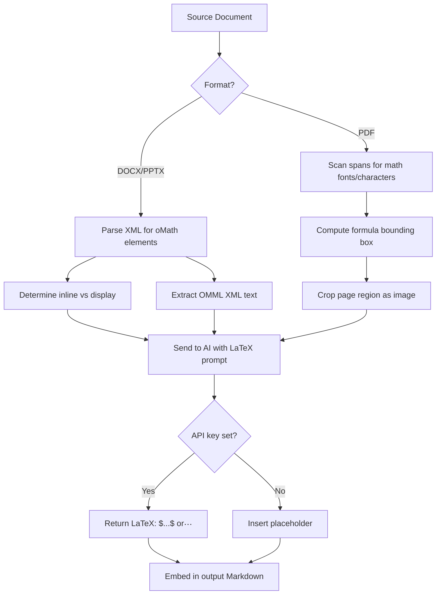

# Spec: LaTeX Formula Extraction

## Problem Statement

Mathematical formulas (integrals, summations, matrices, etc.) in source documents are currently lost or degraded to garbled text during extraction. We need to detect them, render them as images where needed, and use AI vision to convert them to proper LaTeX notation in the output Markdown.

## Requirements

- Detect mathematical formulas in DOCX, PPTX, and PDF files
- Convert all formulas to LaTeX using AI vision (render formula → image → send to LLM, or send OMML XML directly)
- Preserve inline (`$...$`) vs display (`$$...$$`) distinction based on source context
- When API key is not set, insert a placeholder: `[FORMULA: could not be converted without API key]`
- No offline conversion library — always use AI for the actual LaTeX generation

## Background

### DOCX/PPTX

Formulas are stored as OMML (`<m:oMath>` / `<m:oMathPara>` XML elements):
- `<m:oMathPara>` wrapping = display mode (block equation)
- Bare `<m:oMath>` = inline equation
- Namespace: `http://schemas.openxmlformats.org/officeDocument/2006/math`
- Can be detected by parsing the XML tree via `python-docx`/`python-pptx` element access
- OMML XML can be sent directly to the LLM as text (no image rendering needed)

### PDF

PyMuPDF's `get_text("dict")` provides span-level font information:
- Math formulas typically use special fonts: Symbol, Cambria Math, CMMI*, CMSY*, CMEX*, MT Extra
- Contain characters in Unicode math blocks (U+2200–U+22FF, U+0391–U+03C9, superscript/subscript)
- Detected regions are cropped from the page as images using `page.get_pixmap(clip=bbox)`
- Inline vs display determined by whether formula spans the line width on its own

### AI Vision

The existing `AIClient` supports image-based prompts. A new prompt variant is needed specifically for LaTeX conversion that:
- Accepts either an image (PDF formulas) or OMML XML text (DOCX/PPTX formulas)
- Returns only the raw LaTeX expression (no delimiters, no explanation)
- Caller wraps with `$...$` or `$$...$$` based on detected mode

## Architecture



### New modules

```
src/knowledge_extractor/
└── formulas/
    ├── __init__.py
    ├── docx_formulas.py    # OMML detection in DOCX
    ├── pptx_formulas.py    # OMML detection in PPTX
    ├── pdf_formulas.py     # Heuristic math region detection in PDF
    └── renderer.py         # PDF formula region → PNG cropping
```

### Modified modules

- `ai.py` — new `convert_formula_to_latex()` method + `FORMULA_PROMPT`
- `extractors/docx_extractor.py` — detect OMML, insert formula markers
- `extractors/pptx_extractor.py` — detect OMML, insert formula markers
- `extractors/pdf_extractor.py` — detect math regions, crop, insert markers
- `pipeline.py` — new step between extract and filter to process formula markers

## Task Breakdown

### Task 1: Create formula detection module for DOCX

**Objective:** Build `src/knowledge_extractor/formulas/docx_formulas.py` that walks a DOCX document's XML tree and identifies all `<m:oMath>` and `<m:oMathPara>` elements.

**Implementation guidance:**
- Access the underlying XML of each paragraph via `para._element` and search for OMML namespace elements
- `<m:oMathPara>` wrapping = display mode; bare `<m:oMath>` = inline
- Return a list of dataclass objects: `FormulaRef(element, paragraph_index, is_inline, context_text)`
- Create `src/knowledge_extractor/formulas/__init__.py` for the package
- Serialize the OMML element to XML string for later AI submission

**Test requirements:** Unit test with a minimal DOCX containing one inline and one display formula, verifying detection and mode classification.

**Demo:** Run detection on a test DOCX and print found formula locations with inline/display labels.

---

### Task 2: Create formula detection module for PPTX

**Objective:** Build `src/knowledge_extractor/formulas/pptx_formulas.py` that detects OMML formulas in PowerPoint shapes.

**Implementation guidance:**
- Iterate slide shapes, access `shape.text_frame` XML elements
- Search for the same OMML namespace elements as in DOCX
- PPTX formulas in text frames are typically display mode (treat as display unless clearly inline in a text run)
- Return similar `FormulaRef` dataclass with slide number and shape context

**Test requirements:** Unit test with a PPTX containing a formula in a text frame.

**Demo:** Run detection on a test PPTX and list found formulas per slide.

---

### Task 3: Create formula detection module for PDF

**Objective:** Build `src/knowledge_extractor/formulas/pdf_formulas.py` that identifies math regions in PDF pages using heuristic font/character analysis.

**Implementation guidance:**
- Use `page.get_text("dict")` to get span-level data with font names and bounding boxes
- Detect math spans by: (a) font name matching (Symbol, Cambria Math, CMMI*, CMSY*, CMEX*, MT Extra, etc.), (b) high concentration of Unicode math characters (U+2200–U+22FF, U+0391–U+03C9, superscript/subscript blocks)
- Group adjacent math spans into formula regions (merge bboxes within vertical proximity)
- Determine inline vs display: if the formula bbox spans most of the line width and is on its own line → display; otherwise → inline
- Return list of `FormulaRegion(page_num, bbox, is_inline, context_text)`

**Test requirements:** Unit test with a PDF containing a known integral formula, verifying the bounding box roughly covers it.

**Demo:** Run detection on a sample PDF and print page numbers + bounding box coordinates of detected formula regions.

---

### Task 4: Render formula regions to images (PDF)

**Objective:** Build `src/knowledge_extractor/formulas/renderer.py` that crops detected PDF formula regions as PNG images for AI vision.

**Implementation guidance:**
- For PDF formulas: use `page.get_pixmap(clip=bbox, dpi=200)` to render the formula region as a PNG
- Save images to the temp directory under a `formulas/` subfolder
- For DOCX/PPTX: no image rendering needed — OMML XML is sent directly as text to AI

**Test requirements:** Test that a PDF formula region renders to a valid PNG file of expected dimensions.

**Demo:** Given a detected formula region in a PDF, produce a cropped PNG in the temp directory.

---

### Task 5: Add LaTeX conversion to AI client

**Objective:** Extend `AIClient` with a `convert_formula_to_latex()` method that accepts either an image path or OMML XML text and returns LaTeX notation.

**Implementation guidance:**
- Add a new prompt constant `FORMULA_PROMPT` that instructs the model to:
  - Convert the given mathematical formula to LaTeX
  - Output ONLY the LaTeX expression (no `$` delimiters, no explanation)
  - For matrices use `\begin{pmatrix}`, for integrals use standard notation, etc.
- If input is an image: send as image content (same pattern as `describe_image`)
- If input is OMML XML text: send as text with instruction to convert OMML to LaTeX
- Return the raw LaTeX string (caller adds `$`/`$$` wrapping based on inline/display)

**Test requirements:** Mock test verifying the prompt structure and that the response is used correctly.

**Demo:** Send a formula image to AI and receive LaTeX back.

---

### Task 6: Integrate formula handling into the DOCX extractor

**Objective:** Modify `docx_extractor.py` to detect formulas during extraction and insert LaTeX markers in the output.

**Implementation guidance:**
- During paragraph processing, check if the paragraph contains OMML elements
- If found: extract the OMML XML, determine inline/display, insert a temporary marker like `<<FORMULA:idx>>` in the markdown output
- Store formula metadata (OMML XML string, is_inline, context) in a list
- Change the extractor to return both markdown and formula metadata (tuple or dataclass)
- When no API key: markers are later replaced with placeholder text

**Test requirements:** Test that a DOCX with a formula produces markdown containing formula markers with correct metadata.

**Demo:** Extract a DOCX with formulas and see markers in intermediate output.

---

### Task 7: Integrate formula handling into the PPTX extractor

**Objective:** Same as Task 6 but for `pptx_extractor.py`.

**Implementation guidance:**
- Mirror the DOCX approach: detect OMML in shape text frames, insert markers, collect metadata
- Formulas in PPTX are typically display mode

**Test requirements:** Test with a PPTX containing a formula.

**Demo:** Extract a PPTX with formulas and see markers in intermediate output.

---

### Task 8: Integrate formula handling into the PDF extractor

**Objective:** Modify `pdf_extractor.py` to detect math regions, crop them, and insert markers.

**Implementation guidance:**
- After text extraction for each page, run the heuristic formula detector
- For each detected formula region: render as image, insert a marker in the text at the appropriate position
- Track formula images and metadata for later AI processing
- Position markers near where the formula text was extracted (or replace garbled text)

**Test requirements:** Test with a PDF containing a visible integral or summation formula.

**Demo:** Extract a PDF with math and see formula markers in intermediate output.

---

### Task 9: Wire formula processing into the pipeline

**Objective:** Modify `pipeline.py` to add a formula conversion step between extraction and filtering.

**Implementation guidance:**
- Add step "2.5" after extraction: process formula markers
- For each marker, call `ai.convert_formula_to_latex()` with the appropriate input (OMML XML for DOCX/PPTX, image path for PDF)
- Wrap result with `$...$` (inline) or `$$...$$` (display)
- If AI unavailable, substitute `[FORMULA: could not be converted without API key]`
- Log formula count and processing time
- Existing image replacement and cleanup steps continue unchanged after

**Test requirements:** Integration test: full pipeline on a small document with formulas produces valid LaTeX in output.

**Demo:** Run the full tool on a mixed document set and verify formulas appear as LaTeX in final markdown files.

---

### Task 10: Update documentation and progress tracking

**Objective:** Update README.md, AGENTS.md, and remove the TODO.md entry for LaTeX.

**Implementation guidance:**
- Document the formula handling in README features section
- Note the API key requirement for formula conversion
- Update AGENTS.md architecture diagram to include `formulas/` package
- Add `formulas/` to the Key Decisions section
- Remove `- [ ] LaTeX` from TODO.md

**Test requirements:** None (documentation only).

**Demo:** README accurately describes formula conversion behavior.
