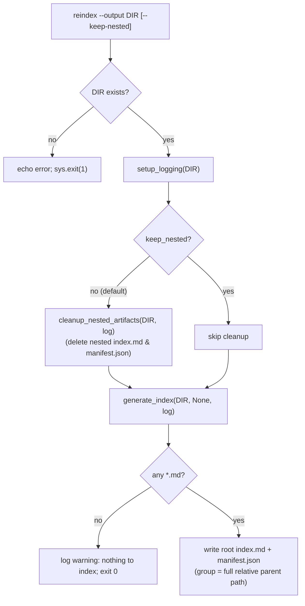

# Reindex Command (`reindex`)

## Problem Statement

The extractor writes `index.md` and `manifest.json` at the root of its output directory
(a "vault"). Users want to **join** multiple vaults — by copying the per-document
subfolders of several vaults into one combined directory — and then rebuild a single,
unified `index.md` + `manifest.json` at the root of that combined directory, covering
**all** subdirectories, **without** re-running the expensive extraction/AI pipeline.

A new `reindex` subcommand regenerates the root index/manifest for a given output
directory purely from the Markdown files already present on disk. It is a cheap,
offline, idempotent operation: no document discovery, no AI calls, no input directory,
and no modification of document content.

## Requirements

- A new `reindex` subcommand is added to the existing Click command group in
  `cli.py` (alongside `convert`, `clear`, `lint`).
- **Signature**: `reindex --output <dir>` where `--output` defaults to `./output`
  (`show_default=True`), matching the `convert`/`clear` option style. A `--keep-nested`
  boolean flag (default off) is also accepted.
- The command regenerates a single `index.md` and `manifest.json` at the **root** of
  `--output`, covering every `*.md` file found recursively under it.
- **Grouping**: documents are grouped by their **full relative parent path** joined with
  forward slashes (`/`). A file at `VaultA/doc.md` → group `VaultA`; a file at
  `VaultA/sub/doc.md` → group `VaultA/sub`. A file directly in the output root → group
  `Root`. Forward slashes are used on all platforms (POSIX-style), consistent with the
  existing `rel.as_posix()` link rendering. **Group-name clarification (finding P4)**:
  `"Root"` is the label for files sitting directly in the output root. If a user also has
  a real subfolder literally named `Root` (`output/Root/doc.md`), its parent path is also
  `"Root"` and the two sets merge under the same `## Root` section. This collision is
  accepted as a known, low-impact edge case (a subfolder named exactly `Root` at the top
  level is rare and the merge is cosmetic, not data-destroying); it is documented here
  rather than special-cased. Links still point to the correct distinct files.
- **Nested-artifact cleanup (content-verified)**: by default, `reindex` deletes
  `index.md` and `manifest.json` found in **subdirectories** of the output root before
  regenerating the root pair — **but only when they are verified to be
  extractor-generated artifacts** (finding P1/E1). A nested `index.md` is deleted only if
  its content begins with the generated-index signature (`# Knowledge Index`); a nested
  `manifest.json` is deleted only if it parses as a JSON array whose entries carry the
  expected manifest keys (`path`, `title`, `group`). Any nested file named `index.md` /
  `manifest.json` that fails verification is treated as **user content**, preserved, and
  logged at warning level. This safeguards Markdown ecosystems (Obsidian folder notes,
  Hugo/Docusaurus/MkDocs index pages) where `index.md` is often a real document. The
  root-level `index.md`/`manifest.json` are never deleted by cleanup (they are overwritten
  by regeneration regardless). A `--keep-nested` flag opts out of cleanup entirely,
  leaving all nested artifacts in place.
- **Hidden/excluded directories (finding E3)**: recursive discovery must skip files whose
  relative path contains a component starting with `.` (e.g. `.git`, `.obsidian`,
  `.venv`). This applies both to indexing (`generate_index`) and to cleanup
  (`cleanup_nested_artifacts`), so stray `.md`/`index.md`/`manifest.json` inside hidden
  tooling folders are neither indexed nor deleted.
- **Pure regeneration**: `reindex` performs no linting and makes no changes to document
  content. It only writes the root `index.md`/`manifest.json` and (unless `--keep-nested`)
  removes verified nested index/manifest artifacts.
- **CLI summary output (finding P2)**: on success, `reindex` echoes a summary line to
  stdout reporting the number of documents indexed and the number of groups created, e.g.
  `Reindexed <output> (42 document(s) across 5 group(s))`. To support this,
  `generate_index` returns a summary `(doc_count, group_count)` (or `(0, 0)` when there is
  nothing to index).
- **No input directory**: `reindex` must not require or accept an `--input` argument, and
  must not depend on `discovery`, the AI pipeline, or an OpenRouter API key.
- **Missing-directory handling**: if the target directory does not exist, the command
  prints an error and exits with a non-zero status (mirroring `_lint`'s behavior for a
  missing directory).
- **Empty-directory handling**: if the directory exists but contains no indexable `*.md`
  files, the command logs/echoes a warning and exits successfully (status 0) without
  writing a manifest (preserving the existing `generate_index` "no files to index"
  behavior).
- The `manifest.json` entry shape is unchanged from the current implementation:
  `{ "path", "title", "group", "headings", "word_count" }`, where `path` is the POSIX
  relative path, `headings` is the first 20 `#`/`##`/`###` headings, and `title` is the
  first `# ` heading (falling back to the file stem).
- Backward compatibility: the existing `convert` pipeline's call to `generate_index`
  continues to work unchanged (its grouping output changes from top-level-folder to
  full-parent-path, which is the intended, consistent behavior across both entry points).

## Background

- **`src/knowledge_extractor/index.py`** contains `generate_index(output_dir, input_dir,
  logger)`. It already:
  - collects `sorted(output_dir.rglob("*.md"))` recursively,
  - excludes files named `index.md` from the listing,
  - computes `rel = f.relative_to(output_dir)` and groups by
    `group = rel.parts[0] if len(rel.parts) > 1 else "Root"` (**this is the line that
    changes** to full-parent-path grouping),
  - extracts `title` via `_extract_title` (first `# ` line, 20-line window, stem
    fallback),
  - extracts `headings` via `re.findall(r"^#{1,3}\s+(.+)$", content, re.MULTILINE)[:20]`,
  - computes `word_count` as `len(content.split())`,
  - writes `index.md` (grouped Markdown with `## <group>` sections and
    `- [title](rel.as_posix())` links) and `manifest.json` (JSON array) to `output_dir`,
  - the `input_dir` parameter is **accepted but unused** in the body — so making it
    optional (`input_dir=None`) and marking it deprecated is safe and lets `reindex` call
    it without an input dir (finding E4).
  - Note on cleanup: nested `index.md` files are already excluded from the index *listing*
    (`f.name != "index.md"`). Cleanup additionally **deletes** stale nested index/manifest
    pairs so a joined vault has exactly one pair at the root — but only after verifying
    each is an extractor-generated artifact (`# Knowledge Index` signature for `index.md`;
    JSON-array-of-entry-dicts for `manifest.json`). Nested files that fail verification are
    user content and are preserved (finding P1/E1).
- **`src/knowledge_extractor/cli.py`** uses a `_DefaultGroup(click.Group)` with
  `default_command="convert"`. Command pattern: a thin `@cli.command()` wrapper builds a
  `types.SimpleNamespace` and delegates to a private `_fn(args)`:
  - `convert` → `_run(args)`
  - `clear` → `_clear(args)` (shows an echo + `click.confirm` prompt; tolerates locked
    files with `ignore_errors`/existence re-check)
  - `lint` → `_lint(args)` (resolves a positional `directory`, `echo` + `sys.exit(1)` if
    missing, iterates `rglob("*.md")`)
  - `_run` calls `setup_logging(args.output)` to get a logger that also writes
    `output/extraction.log`, then calls `generate_index(args.output, args.input, log)` at
    the end.
- **`src/knowledge_extractor/logging_setup.py`** → `setup_logging(output_dir)` returns the
  `"knowledge_extractor"` logger and attaches a file handler at
  `output_dir/extraction.log`. `reindex` reuses this so a `reindex` run is logged
  consistently with `convert`.
- **`pyproject.toml`** exposes `knowledge-extractor = cli:main`. `reindex` is a
  subcommand of that group; no new `[project.scripts]` entry is needed.
- **Tests** live in `tests/`, use `pytest`, and exercise the CLI via
  `click.testing.CliRunner().invoke(cli.cli, argv, ...)` (see `tests/test_cli_translate.py`).

## Proposed Solution

Refactor the shared index logic so both `convert` and `reindex` use it, then add the
`reindex` command and a small cleanup helper.



### Data model (unchanged manifest entry)

```json
{
  "path": "VaultA/sub/doc.md",
  "title": "Document Title",
  "group": "VaultA/sub",
  "headings": ["Document Title", "Section One"],
  "word_count": 1234
}
```

### `index.py` changes

1. **Grouping** — replace the top-level-folder grouping with full-parent-path grouping:

   ```python
   rel = f.relative_to(output_dir)
   if len(rel.parts) > 1:
       group = "/".join(rel.parts[:-1])  # full relative parent path, POSIX-style
   else:
       group = "Root"
   ```

2. **Optional, deprecated `input_dir`** (finding E4) — change the signature to
   `generate_index(output_dir, input_dir=None, logger=None)` and document in the docstring
   that `input_dir` is **deprecated and ignored** (retained only for positional
   compatibility with the existing `_run` call `generate_index(args.output, args.input,
   log)`). If `logger` is `None`, fall back to the module-level `log`.

3. **Single-pass file read + summary return** (findings E2, P2) — read each file's content
   exactly once and reuse it for title, headings, and word count; return a summary:

   ```python
   def _extract_title(content: str, stem: str) -> str:
       for line in content.splitlines()[:20]:
           if line.startswith("# "):
               return line[2:].strip()
       return stem

   def generate_index(output_dir, input_dir=None, logger=None) -> tuple[int, int]:
       """Regenerate root index.md + manifest.json. `input_dir` is deprecated/ignored.

       Returns (doc_count, group_count).
       """
       logger = logger or log
       md_files = [f for f in sorted(output_dir.rglob("*.md"))
                   if f.name != "index.md" and not _is_hidden(f, output_dir)]
       if not md_files:
           logger.warning("No output files to index")
           return (0, 0)
       # ... for each file: content = f.read_text(...) read ONCE;
       #     title = _extract_title(content, f.stem); headings = re.findall(...);
       #     word_count = len(content.split())
       # ... write index.md + manifest.json
       return (len(md_files), len(groups))
   ```

4. **Hidden-directory exclusion** (finding E3):

   ```python
   def _is_hidden(path: Path, output_dir: Path) -> bool:
       """True if any component of path's parent (relative to output_dir) starts with '.'."""
       rel = path.relative_to(output_dir)
       return any(part.startswith(".") for part in rel.parts[:-1])
   ```

5. **Content-verified `cleanup_nested_artifacts`** (findings P1/E1, E3) — only delete
   files proven to be extractor-generated; skip hidden dirs; tolerate locked files:

   ```python
   def _is_generated_index(path: Path) -> bool:
       try:
           with path.open(encoding="utf-8", errors="ignore") as fh:
               head = fh.read(256)
       except OSError:
           return False
       return head.lstrip().startswith("# Knowledge Index")

   def _is_generated_manifest(path: Path) -> bool:
       try:
           data = json.loads(path.read_text(encoding="utf-8", errors="ignore"))
       except (OSError, ValueError):
           return False
       if not isinstance(data, list):
           return False
       # Empty manifest is a valid generated artifact; non-empty must look like entries.
       return all(isinstance(e, dict) and {"path", "title", "group"} <= set(e)
                  for e in data)

   def cleanup_nested_artifacts(output_dir: Path, logger=None) -> int:
       """Delete VERIFIED generated index.md / manifest.json in SUBDIRECTORIES.

       The root-level pair is left untouched (regenerated afterward). A nested file is
       deleted only if it passes _is_generated_index / _is_generated_manifest; otherwise
       it is treated as user content, preserved, and logged. Hidden directories are
       skipped. Individual unlink failures (locked/read-only files) are logged and skipped.
       Returns the number of files removed.
       """
       logger = logger or log
       root = output_dir.resolve()
       removed = 0
       checks = {"index.md": _is_generated_index, "manifest.json": _is_generated_manifest}
       for name, is_generated in checks.items():
           for path in output_dir.rglob(name):
               if path.resolve().parent == root:
                   continue  # keep the root pair
               if _is_hidden(path, output_dir):
                   continue  # never touch files inside hidden dirs
               if not is_generated(path):
                   logger.warning(f"Preserving user content (not a generated artifact): {path}")
                   continue
               try:
                   path.unlink()
                   removed += 1
                   logger.info(f"Removed nested artifact: {path}")
               except OSError as e:
                   logger.warning(f"Could not remove {path}: {e}")
       return removed
   ```

### `cli.py` changes

Add the command and its private worker:

```python
@cli.command()
@click.option("--output", type=click.Path(path_type=Path), default=Path("./output"),
              show_default=True, help="Output directory (vault) to reindex")
@click.option("--keep-nested", is_flag=True,
              help="Keep nested index.md/manifest.json in subdirectories (default: remove them)")
def reindex(output, keep_nested):
    """Rebuild the root index.md/manifest.json covering all subdirectories.

    Useful after joining multiple vaults into one output directory. Pure
    regeneration — no extraction, no AI, no linting.
    """
    args = SimpleNamespace(output=output, keep_nested=keep_nested)
    _reindex(args)


def _reindex(args):
    output = args.output.resolve()
    if not output.exists():
        click.echo(f"Directory not found: {output}")
        sys.exit(1)

    log = setup_logging(args.output)
    log.info(f"Reindexing: {output}")

    if not args.keep_nested:
        removed = cleanup_nested_artifacts(args.output, log)
        if removed:
            click.echo(f"Removed {removed} nested index/manifest file(s)")

    doc_count, group_count = generate_index(args.output, None, log)
    if doc_count:
        click.echo(f"Reindexed {output} "
                   f"({doc_count} document(s) across {group_count} group(s))")
    else:
        click.echo(f"Nothing to index in {output}")
```

Import `cleanup_nested_artifacts` from `.index` alongside `generate_index`.

## Task Breakdown

### Task 1 — Full-parent-path grouping + single-pass read in `generate_index` (test-first)

- **Objective**: Change grouping from top-level folder to full relative parent path
  joined with `/` (root files remain `"Root"`); make `input_dir` optional/deprecated;
  read each file once; skip hidden dirs; return `(doc_count, group_count)`.
- **Implementation guidance**: Edit `src/knowledge_extractor/index.py`. Replace the
  `group = rel.parts[0] if len(rel.parts) > 1 else "Root"` line with the
  `"/".join(rel.parts[:-1])` form. Change the signature to
  `generate_index(output_dir, input_dir=None, logger=None) -> tuple[int, int]`; add
  `logger = logger or log`; mark `input_dir` deprecated/ignored in the docstring (finding
  E4). Refactor `_extract_title` to take `(content: str, stem: str)` and read file content
  **once** per document, reusing it for title/headings/word_count (finding E2). Add the
  `_is_hidden` helper and exclude hidden-dir files from the `rglob` listing (finding E3).
  Return `(len(md_files), len(groups))`; return `(0, 0)` and warn when there are no files.
  Do not change the manifest entry shape or the index link rendering.
- **Test requirements**: Create `tests/test_index.py`. Build a `tmp_path` output dir with:
  a root file (`root.md`), a one-level nested file (`VaultA/a.md`), a two-level nested
  file (`VaultA/sub/b.md`), and a hidden-dir file (`.obsidian/note.md`), each with a
  `# Title` first line. Call `generate_index(tmp_path)`. Assert: the return value is
  `(3, 3)` (hidden-dir file excluded); the parsed `manifest.json` contains entries with
  `group` values `"Root"`, `"VaultA"`, and `"VaultA/sub"` and does **not** include the
  `.obsidian` file; `index.md` contains headers `## Root`, `## VaultA`, `## VaultA/sub`;
  links use POSIX separators. Add a case asserting `generate_index` on an empty dir
  returns `(0, 0)` and writes no `manifest.json`.
- **Demo**: `uv run pytest tests/test_index.py -k "grouping or summary"`.

### Task 2 — Content-verified `cleanup_nested_artifacts` helper (test-first)

- **Objective**: Add a helper that removes **only verified generated** `index.md`/
  `manifest.json` from subdirectories, preserving the root pair and any user content,
  skipping hidden dirs, returning a count and tolerating locked files.
- **Implementation guidance**: Add `_is_generated_index`, `_is_generated_manifest`, and
  `cleanup_nested_artifacts(output_dir, logger=None)` to
  `src/knowledge_extractor/index.py` as sketched above. A nested `index.md` is removed
  only if its content starts with `# Knowledge Index`; a nested `manifest.json` only if it
  parses as a JSON array of entry dicts carrying `path`/`title`/`group` (an empty array is
  a valid generated artifact). Skip hidden dirs via `_is_hidden`. Compare resolved parents
  to the resolved root to keep the root pair. Catch `OSError` per file.
- **Test requirements**: In `tests/test_index.py`:
  - Create a root `index.md` + `manifest.json` (both generated-looking) plus **generated**
    nested copies under `VaultA/` and `VaultA/sub/`; call the helper; assert nested
    generated files removed, root files preserved, return value equals the count removed.
  - **User-content preservation (finding E1/P1)**: create a nested `index.md` whose first
    line is `# My Project Notes` (not the generated signature) and a nested `manifest.json`
    containing `{"custom": true}`; assert both are **preserved** and not counted.
  - Create a hidden-dir generated artifact (`.obsidian/index.md` with the signature) and
    assert it is **preserved** (hidden dirs are never touched).
  - No-nested-artifacts case returns `0`.
  - **Resilience (finding E5)**: simulate an unlink failure (e.g. monkeypatch
    `Path.unlink` to raise `OSError` for one file, or mark a file read-only on platforms
    that enforce it); assert the helper logs and continues without raising, and the count
    reflects only successfully removed files.
- **Demo**: `uv run pytest tests/test_index.py -k cleanup`.

### Task 3 — `reindex` CLI command (test-first)

- **Objective**: Expose `reindex` as a subcommand that validates the directory,
  optionally cleans nested artifacts, and regenerates the root index/manifest.
- **Implementation guidance**: Edit `src/knowledge_extractor/cli.py`: import
  `cleanup_nested_artifacts`, add the `reindex` command and `_reindex(args)` worker as
  sketched above. Reuse `setup_logging`. No AI client, no `discover_files`, no
  `input_dir`.
- **Test requirements**: Create `tests/test_cli_reindex.py`. Using `CliRunner`:
  - Build a temp dir with root + nested `*.md` and **generated** nested
    `index.md`/`manifest.json`; invoke `reindex --output <dir>`; assert exit 0, root
    `index.md`/`manifest.json` exist, manifest contains all docs with correct `group`
    values, generated nested `index.md`/`manifest.json` are removed, and stdout contains
    the summary line with the document and group counts (finding P2).
  - **User-content preservation**: include a nested `index.md` without the generated
    signature; assert it survives a default `reindex` run.
  - Invoke with `--keep-nested`; assert all nested artifacts are preserved.
  - Invoke against a non-existent dir; assert non-zero exit code.
  - Invoke against an existing but empty dir; assert exit 0, no `manifest.json` written,
    and the "Nothing to index" message.
- **Demo**: `uv run knowledge-extractor reindex --output ./output` and
  `uv run knowledge-extractor reindex --output ./output --keep-nested`.

### Task 4 — README documentation

- **Objective**: Document the new command, its flags, and the join-vaults use case.
- **Implementation guidance**: Edit `README.md`: add `reindex` to the "Other subcommands"
  sentence, add a usage snippet
  (`uv run knowledge-extractor reindex --output ./output [--keep-nested]`), and a short
  note explaining the vault-join scenario and that **verified** nested index/manifest
  artifacts are removed by default (`--keep-nested` to opt out; user-content `index.md`
  files are preserved). Mention `--output` default `./output`. **Vault-join guidance
  (finding P3)**: advise users to place each joined vault under a **distinct parent
  folder** inside the combined output dir (e.g. `combined/VaultA/`, `combined/VaultB/`) so
  documents with identical relative paths do not silently overwrite each other on the
  filesystem before `reindex` runs.
- **Test requirements**: N/A (docs); verify by reading the rendered section.
- **Demo**: README shows `reindex`, `--keep-nested`, and the rationale.

### Task 5 — Full verification pass

- **Objective**: Ensure the entire suite passes and the command works end-to-end.
- **Implementation guidance**: Run `uv run pytest` and `uv run knowledge-extractor
  reindex -h`. Confirm the existing `convert` path still calls `generate_index`
  successfully (positional `input_dir` call remains valid).
- **Test requirements**: `uv run pytest` is green.
- **Demo**: `uv run pytest`; `uv run knowledge-extractor reindex -h`.

## Assumptions (recorded, non-blocking)

- A1: Grouping uses forward slashes on all platforms, matching the existing POSIX link
  rendering. (Session decision 1-a.)
- A2: Cleanup is **default-on** with a `--keep-nested` opt-out, not a confirmation prompt;
  nested index/manifest files are regenerable artifacts and the cost of accidental removal
  is low. (Session decision 2-b.)
- A3: `reindex` does **not** lint. (Session decision 3-a.)
- A4: The grouping change also affects the `convert` pipeline's index output; this is
  intended so both entry points produce consistent grouping.
- A5: `reindex` is non-recursive about vault semantics — it treats the output dir as a flat
  pool of Markdown files organized by relative path. It does not attempt to merge or
  reconcile conflicting document paths across joined vaults; identical relative paths would
  collide on the filesystem before `reindex` ever runs (the user controls the join). The
  README documents the "distinct parent folder per vault" practice to avoid collisions
  (finding P3).

## Critique Resolution (Pass 1 — `docs/critiques/reindex-command-critique.md`)

Verdict ⚠️ PROCEED WITH UPDATES; all findings applied to this spec:

- **P1 / E1 (🎯 Must-Address)** — content-verified cleanup: `cleanup_nested_artifacts` now
  deletes a nested `index.md`/`manifest.json` only when verified as an extractor-generated
  artifact; user content named `index.md`/`manifest.json` is preserved and logged.
- **E2 (💡)** — single-pass file read in `generate_index`; `_extract_title` now takes
  pre-read `content`.
- **P2 (💡)** — `generate_index` returns `(doc_count, group_count)`; `_reindex` echoes a
  summary line.
- **E3 (💡)** — hidden-directory exclusion (`_is_hidden`) applied to both indexing and
  cleanup.
- **P3 (💡)** — README vault-join guidance (distinct parent folders) added to Task 4.
- **E4 (💡)** — `input_dir` documented as deprecated/ignored.
- **P4 (🤔)** — `Root` group-name collision documented as an accepted low-impact edge case.
- **E5 (🤔)** — cleanup resilience + user-content-preservation test cases added to Task 2.
