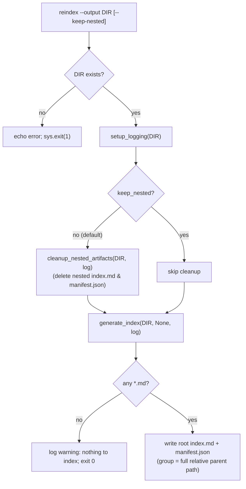

# Reindex Command (`reindex`)

## Problem Statement

The extractor writes `index.md` and `manifest.json` at the root of its output directory
(a "vault"). Users want to **join** multiple vaults — by copying the per-document
subfolders of several vaults into one combined directory — and then rebuild a single,
unified `index.md` + `manifest.json` at the root of that combined directory, covering
**all** subdirectories, **without** re-running the expensive extraction/AI pipeline.

A new `reindex` subcommand regenerates the root index/manifest for a given output
directory purely from the Markdown files already present on disk. It is a cheap,
offline, idempotent operation: no document discovery, no AI calls, no input directory,
and no modification of document content.

## Requirements

- A new `reindex` subcommand is added to the existing Click command group in
  `cli.py` (alongside `convert`, `clear`, `lint`).
- **Signature**: `reindex --output <dir>` where `--output` defaults to `./output`
  (`show_default=True`), matching the `convert`/`clear` option style. A `--keep-nested`
  boolean flag (default off) is also accepted.
- The command regenerates a single `index.md` and `manifest.json` at the **root** of
  `--output`, covering every `*.md` file found recursively under it.
- **Grouping**: documents are grouped by their **full relative parent path** joined with
  forward slashes (`/`). A file at `VaultA/doc.md` → group `VaultA`; a file at
  `VaultA/sub/doc.md` → group `VaultA/sub`. A file directly in the output root → group
  `Root`. Forward slashes are used on all platforms (POSIX-style), consistent with the
  existing `rel.as_posix()` link rendering.
- **Nested-artifact cleanup**: by default, `reindex` deletes any `index.md` and
  `manifest.json` found in **subdirectories** of the output root before regenerating the
  root pair. The root-level `index.md`/`manifest.json` are not deleted by cleanup (they
  are overwritten by regeneration regardless). A `--keep-nested` flag opts out of cleanup,
  leaving nested artifacts in place.
- **Pure regeneration**: `reindex` performs no linting and makes no changes to document
  content. It only writes the root `index.md`/`manifest.json` and (unless `--keep-nested`)
  removes nested index/manifest files.
- **No input directory**: `reindex` must not require or accept an `--input` argument, and
  must not depend on `discovery`, the AI pipeline, or an OpenRouter API key.
- **Missing-directory handling**: if the target directory does not exist, the command
  prints an error and exits with a non-zero status (mirroring `_lint`'s behavior for a
  missing directory).
- **Empty-directory handling**: if the directory exists but contains no indexable `*.md`
  files, the command logs/echoes a warning and exits successfully (status 0) without
  writing a manifest (preserving the existing `generate_index` "no files to index"
  behavior).
- The `manifest.json` entry shape is unchanged from the current implementation:
  `{ "path", "title", "group", "headings", "word_count" }`, where `path` is the POSIX
  relative path, `headings` is the first 20 `#`/`##`/`###` headings, and `title` is the
  first `# ` heading (falling back to the file stem).
- Backward compatibility: the existing `convert` pipeline's call to `generate_index`
  continues to work unchanged (its grouping output changes from top-level-folder to
  full-parent-path, which is the intended, consistent behavior across both entry points).

## Background

- **`src/knowledge_extractor/index.py`** contains `generate_index(output_dir, input_dir,
  logger)`. It already:
  - collects `sorted(output_dir.rglob("*.md"))` recursively,
  - excludes files named `index.md` from the listing,
  - computes `rel = f.relative_to(output_dir)` and groups by
    `group = rel.parts[0] if len(rel.parts) > 1 else "Root"` (**this is the line that
    changes** to full-parent-path grouping),
  - extracts `title` via `_extract_title` (first `# ` line, 20-line window, stem
    fallback),
  - extracts `headings` via `re.findall(r"^#{1,3}\s+(.+)$", content, re.MULTILINE)[:20]`,
  - computes `word_count` as `len(content.split())`,
  - writes `index.md` (grouped Markdown with `## <group>` sections and
    `- [title](rel.as_posix())` links) and `manifest.json` (JSON array) to `output_dir`,
  - the `input_dir` parameter is **accepted but unused** in the body — so making it
    optional (`input_dir=None`) is safe and lets `reindex` call it without an input dir.
  - Note: nested `manifest.json` files are currently **not** excluded from the manifest
    listing. They are not `*.md`, so they never appear as index entries; cleanup is about
    removing stale nested `index.md`/`manifest.json` so the joined vault has exactly one
    pair at the root. Nested `index.md` files are already excluded from *listing* but are
    still deleted by cleanup to avoid confusion.
- **`src/knowledge_extractor/cli.py`** uses a `_DefaultGroup(click.Group)` with
  `default_command="convert"`. Command pattern: a thin `@cli.command()` wrapper builds a
  `types.SimpleNamespace` and delegates to a private `_fn(args)`:
  - `convert` → `_run(args)`
  - `clear` → `_clear(args)` (shows an echo + `click.confirm` prompt; tolerates locked
    files with `ignore_errors`/existence re-check)
  - `lint` → `_lint(args)` (resolves a positional `directory`, `echo` + `sys.exit(1)` if
    missing, iterates `rglob("*.md")`)
  - `_run` calls `setup_logging(args.output)` to get a logger that also writes
    `output/extraction.log`, then calls `generate_index(args.output, args.input, log)` at
    the end.
- **`src/knowledge_extractor/logging_setup.py`** → `setup_logging(output_dir)` returns the
  `"knowledge_extractor"` logger and attaches a file handler at
  `output_dir/extraction.log`. `reindex` reuses this so a `reindex` run is logged
  consistently with `convert`.
- **`pyproject.toml`** exposes `knowledge-extractor = cli:main`. `reindex` is a
  subcommand of that group; no new `[project.scripts]` entry is needed.
- **Tests** live in `tests/`, use `pytest`, and exercise the CLI via
  `click.testing.CliRunner().invoke(cli.cli, argv, ...)` (see `tests/test_cli_translate.py`).

## Proposed Solution

Refactor the shared index logic so both `convert` and `reindex` use it, then add the
`reindex` command and a small cleanup helper.



### Data model (unchanged manifest entry)

```json
{
  "path": "VaultA/sub/doc.md",
  "title": "Document Title",
  "group": "VaultA/sub",
  "headings": ["Document Title", "Section One"],
  "word_count": 1234
}
```

### `index.py` changes

1. **Grouping** — replace the top-level-folder grouping with full-parent-path grouping:

   ```python
   rel = f.relative_to(output_dir)
   if len(rel.parts) > 1:
       group = "/".join(rel.parts[:-1])  # full relative parent path, POSIX-style
   else:
       group = "Root"
   ```

2. **Optional `input_dir`** — change the signature to
   `generate_index(output_dir, input_dir=None, logger=None)` (keep positional
   compatibility with the existing `_run` call `generate_index(args.output, args.input,
   log)`). If `logger` is `None`, fall back to the module-level `log`.

3. **`cleanup_nested_artifacts`** — add:

   ```python
   def cleanup_nested_artifacts(output_dir: Path, logger=None) -> int:
       """Delete index.md / manifest.json found in SUBDIRECTORIES of output_dir.

       The root-level pair is left untouched (it is regenerated afterward). Returns
       the number of files removed. Individual unlink failures (e.g. locked files)
       are logged and skipped, mirroring the resilience of the `clear` command.
       """
       logger = logger or log
       root = output_dir.resolve()
       removed = 0
       for name in ("index.md", "manifest.json"):
           for path in output_dir.rglob(name):
               if path.resolve().parent == root:
                   continue  # keep the root pair
               try:
                   path.unlink()
                   removed += 1
                   logger.info(f"Removed nested artifact: {path}")
               except OSError as e:
                   logger.warning(f"Could not remove {path}: {e}")
       return removed
   ```

### `cli.py` changes

Add the command and its private worker:

```python
@cli.command()
@click.option("--output", type=click.Path(path_type=Path), default=Path("./output"),
              show_default=True, help="Output directory (vault) to reindex")
@click.option("--keep-nested", is_flag=True,
              help="Keep nested index.md/manifest.json in subdirectories (default: remove them)")
def reindex(output, keep_nested):
    """Rebuild the root index.md/manifest.json covering all subdirectories.

    Useful after joining multiple vaults into one output directory. Pure
    regeneration — no extraction, no AI, no linting.
    """
    args = SimpleNamespace(output=output, keep_nested=keep_nested)
    _reindex(args)


def _reindex(args):
    output = args.output.resolve()
    if not output.exists():
        click.echo(f"Directory not found: {output}")
        sys.exit(1)

    log = setup_logging(args.output)
    log.info(f"Reindexing: {output}")

    if not args.keep_nested:
        removed = cleanup_nested_artifacts(args.output, log)
        if removed:
            click.echo(f"Removed {removed} nested index/manifest file(s)")

    generate_index(args.output, None, log)
    click.echo(f"Reindexed {output}")
```

Import `cleanup_nested_artifacts` from `.index` alongside `generate_index`.

## Task Breakdown

### Task 1 — Full-parent-path grouping in `generate_index` (test-first)

- **Objective**: Change grouping from top-level folder to full relative parent path
  joined with `/`; root files remain `"Root"`. Make `input_dir` optional.
- **Implementation guidance**: Edit `src/knowledge_extractor/index.py`. Replace the
  `group = rel.parts[0] if len(rel.parts) > 1 else "Root"` line with the
  `"/".join(rel.parts[:-1])` form shown above. Change the signature to
  `generate_index(output_dir, input_dir=None, logger=None)` and add
  `logger = logger or log` at the top of the body; replace the `logger.*` calls
  accordingly. Do not change the manifest entry shape or the index link rendering.
- **Test requirements**: Create `tests/test_index.py`. Build a `tmp_path` output dir with:
  a root file (`root.md`), a one-level nested file (`VaultA/a.md`), and a two-level nested
  file (`VaultA/sub/b.md`), each with a `# Title` first line. Call
  `generate_index(tmp_path)`. Assert the parsed `manifest.json` contains entries with
  `group` values `"Root"`, `"VaultA"`, and `"VaultA/sub"` for the respective files, and
  that `index.md` contains the headers `## Root`, `## VaultA`, and `## VaultA/sub`. Assert
  links use POSIX separators.
- **Demo**: `uv run pytest tests/test_index.py -k grouping`.

### Task 2 — `cleanup_nested_artifacts` helper (test-first)

- **Objective**: Add a helper that removes `index.md`/`manifest.json` from
  subdirectories while preserving the root pair, returning a count and tolerating locked
  files.
- **Implementation guidance**: Add `cleanup_nested_artifacts(output_dir, logger=None)` to
  `src/knowledge_extractor/index.py` as sketched above. Compare resolved parents to the
  resolved root to decide what to keep. Catch `OSError` per file.
- **Test requirements**: In `tests/test_index.py`, create a root `index.md` +
  `manifest.json` plus nested copies under `VaultA/` and `VaultA/sub/`. Call the helper
  and assert: nested files removed, root files preserved, return value equals the number
  of nested files removed. Add a case with no nested artifacts returning `0`.
- **Demo**: `uv run pytest tests/test_index.py -k cleanup`.

### Task 3 — `reindex` CLI command (test-first)

- **Objective**: Expose `reindex` as a subcommand that validates the directory,
  optionally cleans nested artifacts, and regenerates the root index/manifest.
- **Implementation guidance**: Edit `src/knowledge_extractor/cli.py`: import
  `cleanup_nested_artifacts`, add the `reindex` command and `_reindex(args)` worker as
  sketched above. Reuse `setup_logging`. No AI client, no `discover_files`, no
  `input_dir`.
- **Test requirements**: Create `tests/test_cli_reindex.py`. Using `CliRunner`:
  - Build a temp dir with root + nested `*.md` and nested `index.md`/`manifest.json`;
    invoke `reindex --output <dir>`; assert exit 0, root `index.md`/`manifest.json` exist,
    manifest contains all docs with correct `group` values, and nested
    `index.md`/`manifest.json` are removed.
  - Invoke with `--keep-nested`; assert nested artifacts are preserved.
  - Invoke against a non-existent dir; assert non-zero exit code.
  - Invoke against an existing but empty dir; assert exit 0 and no `manifest.json`
    written.
- **Demo**: `uv run knowledge-extractor reindex --output ./output` and
  `uv run knowledge-extractor reindex --output ./output --keep-nested`.

### Task 4 — README documentation

- **Objective**: Document the new command, its flags, and the join-vaults use case.
- **Implementation guidance**: Edit `README.md`: add `reindex` to the "Other subcommands"
  sentence, add a usage snippet
  (`uv run knowledge-extractor reindex --output ./output [--keep-nested]`), and a short
  note explaining the vault-join scenario and that nested index/manifest files are removed
  by default (`--keep-nested` to opt out). Mention `--output` default `./output`.
- **Test requirements**: N/A (docs); verify by reading the rendered section.
- **Demo**: README shows `reindex`, `--keep-nested`, and the rationale.

### Task 5 — Full verification pass

- **Objective**: Ensure the entire suite passes and the command works end-to-end.
- **Implementation guidance**: Run `uv run pytest` and `uv run knowledge-extractor
  reindex -h`. Confirm the existing `convert` path still calls `generate_index`
  successfully (positional `input_dir` call remains valid).
- **Test requirements**: `uv run pytest` is green.
- **Demo**: `uv run pytest`; `uv run knowledge-extractor reindex -h`.

## Assumptions (recorded, non-blocking)

- A1: Grouping uses forward slashes on all platforms, matching the existing POSIX link
  rendering. (Session decision 1-a.)
- A2: Cleanup is **default-on** with a `--keep-nested` opt-out, not a confirmation prompt;
  nested index/manifest files are regenerable artifacts and the cost of accidental removal
  is low. (Session decision 2-b.)
- A3: `reindex` does **not** lint. (Session decision 3-a.)
- A4: The grouping change also affects the `convert` pipeline's index output; this is
  intended so both entry points produce consistent grouping.
- A5: `reindex` is non-recursive about vault semantics — it treats the output dir as a flat
  pool of Markdown files organized by relative path. It does not attempt to merge or
  reconcile conflicting document paths across joined vaults; identical relative paths would
  collide on the filesystem before `reindex` ever runs (the user controls the join).
