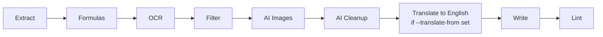

# Translation to English (`--translate-from`)

## Problem Statement

The knowledge extractor produces Markdown in the source document's language. We want an
opt-in translation capability: when invoked with `--translate-from <language>`, the pipeline
translates the fully-assembled Markdown output into English as a dedicated final pass, after
AI cleanup and before writing/linting. Translation always targets English.

## Requirements

- Activated by a new CLI option `--translate-from <language>`. The value is a free-form string
  (e.g., `German`, `de`, `Ukrainian`). It is sanitized before being formatted into the prompt:
  newlines and control characters are stripped/rejected to avoid prompt-injection via the flag
  value (finding P3).
- Translation always targets English (no target-language option).
- Translation runs as a dedicated final pass on the assembled `final_md`, after AI cleanup
  (step 5) and before write (step 6).
- Configurable translation model via a new `--translate-model` flag. Default:
  `mistralai/mistral-large-2512` (a strong text-only, multilingual instruction-follower well
  suited to preserving Markdown/LaTeX/Mermaid structure while translating). Falls back to
  `--model` if `--translate-model` is not provided. A separate `AIClient` instance handles
  translation.
- Translate all natural-language content, including `Figure:` descriptions and natural-language
  labels inside Mermaid diagrams, while preserving Markdown structure, fenced code blocks,
  Mermaid keywords/graph syntax, LaTeX (`$...$`, `$$...$$`) delimiters and expressions, tables,
  and URLs. For Mermaid specifically, only human-readable label text inside brackets/quotes is
  translated; node identifiers, arrows, and structural keywords (`graph`, `flowchart`,
  `subgraph`, `end`) are left untouched (finding P2).
- Whole-document translation in a single call; chunk only when content exceeds a size threshold,
  reusing the existing section-boundary chunking. The translation threshold defaults to `50000`
  characters so that virtually all standard technical documents are translated in a single pass,
  reducing API round-trips and cross-section context loss (finding E3).
- Translation must degrade gracefully and never crash the pipeline for an otherwise-processable
  document: if no API key is set (`AIClient.client is None`), translation is skipped, the original
  content is kept, and a warning is logged. During chunked translation, both `AIBadRequestError`
  and `AIProviderError` are caught per chunk — the original chunk text is retained and a warning
  logged — matching the graceful-degradation behavior of other AI steps (finding E1).
- Existing incremental skip behavior is unchanged: output existence means skip. Re-translation
  requires deleting the output file (or output dir, or using the `clear` subcommand) and
  re-running with `--translate-from`. When `--translate-from` is set and one or more files are
  skipped because their outputs already exist, `cli.py` logs an informational warning so the user
  understands why pre-existing outputs were not translated (finding P1).

## Background

- The pipeline (`pipeline.py::process_file`) runs stages in order: extract → formulas → OCR →
  filter → AI images → AI cleanup → write → lint. Translation slots in as a new step 5b between
  AI cleanup (step 5) and write (step 6).
- All AI work currently goes through one module-level `AIClient` (`pipeline.py::_get_ai`) built
  from `args.model`. Rather than adding a second parallel singleton and a duplicate accessor,
  generalize `_get_ai` to cache `AIClient` instances in a dict keyed by model name
  (`_ai_clients[model]`). The translation client is just another entry keyed by the translation
  model, and end-of-run usage can be aggregated across all cached clients (finding E2).
- `AIClient` (`ai.py`) already has reusable machinery: `_call` (retry/cost tracking),
  `_split_into_chunks` (section-boundary splitting at `## ` headers with paragraph fallback),
  and `cleanup_content` — a chunked, text-only operation that is the direct template for
  `translate_content`.
- `cleanup_content` returns `None` when `self.client` is `None`, single-passes when input is at
  or below `chunk_size`, and otherwise chunks and rejoins with `"\n\n"`. `translate_content`
  should mirror this exactly.
- `_split_into_chunks`' line-based fallback (used when a single section exceeds `chunk_size`) can
  split fenced code blocks, tables, or LaTeX display math (`$$...$$`) across chunk boundaries and
  corrupt them. The high default translation threshold (50000) makes this fallback rare, but the
  splitter should also avoid breaking inside a fenced code block (` ``` `) when it must split an
  oversized section (finding E4).
- Translation is text-only (input is assembled Markdown, no images), so the default model should
  be a text model rather than the vision `--model`. `mistralai/mistral-large-2512` is a strong
  multilingual, instruction-following text model, chosen for reliable structure preservation.
- The end-of-run AI usage summary is emitted from `cli.py::_run` via `get_ai_client()` and
  `ai_client.log_usage_summary()`. With clients cached by model, the summary should aggregate
  usage across all instantiated clients (or log each once) so the translation model's usage is
  surfaced.
- No pytest harness exists yet: `pyproject.toml` has no test dependency group, and the `test/`
  directory holds sample data, not test code. The plan sets up a minimal harness.

## Proposed Solution

Add a `TRANSLATE_PROMPT` and a `translate_content` method to `AIClient`, mirroring
`cleanup_content` (single-pass under a threshold, chunked above it via `_split_into_chunks`,
`_call` for retries/cost). During chunked translation, catch both `AIBadRequestError` and
`AIProviderError` per chunk, keep the original chunk on failure, and log a warning so a
transient/provider error never crashes the whole document. Use a high default `chunk_size`
(50000) so typical documents translate in a single pass. Add `--translate-from` (sanitized) and
`--translate-model` to the CLI and thread them through `args`. In the pipeline, generalize
`_get_ai` to cache `AIClient` instances by model name, select the translation model as
`args.translate_model or args.model`, and invoke translation as step 5b when `translate_from` is
set. Aggregate end-of-run usage across all cached clients so the translation model's usage is
reported. Update README and this spec's sibling docs.



## Tasks

### Task 1: Set up a minimal pytest harness

- **Objective:** Enable unit testing for the project.
- **Implementation guidance:**
  - Add a dev dependency group to `pyproject.toml` (e.g., `[dependency-groups] dev = ["pytest"]`
    per uv conventions) with `pytest`.
  - Create a `tests/` directory with `__init__.py` and a `conftest.py` if needed so
    `src/knowledge_extractor` is importable (the project is packaged via `[tool.uv] package = true`).
  - Add a trivial smoke test (e.g., `tests/test_smoke.py`) that imports
    `knowledge_extractor.ai` and asserts `AIClient` is importable.
- **Test:** `uv run pytest` discovers and passes the smoke test.
- **Demo:** Run `uv run pytest` and show a green collection/pass.

### Task 2: Add the translation prompt and `AIClient.translate_content`

- **Objective:** Implement translation logic in `ai.py`.
- **Implementation guidance:**
  - Add a `TRANSLATE_PROMPT` template parameterized by `{source_language}` and `{content}`.
    Instructions: translate all prose and natural-language text (including `Figure:` descriptions
    and Mermaid node/edge labels) from the source language into English; preserve Markdown
    structure, fenced code blocks, LaTeX (`$...$`, `$$...$$`) delimiters and expressions, tables,
    and URLs; output translated Markdown only, no commentary.
  - For Mermaid, include explicit negative rules **and an example** (finding P2): translate only
    the human-readable label text inside brackets/quotes; never modify node identifiers, arrows,
    or structural keywords. E.g. `A[Angemeldet]` → `A[Logged in]` (the `A[...]` id stays), and
    `graph`, `flowchart`, `subgraph`, `end`, `-->`, `---` are left verbatim.
  - Add `translate_content(self, markdown: str, source_language: str, chunk_size: int = 50000)`
    mirroring `cleanup_content` (finding E3 sets the higher default threshold):
    - return `None` if `self.client` is `None`;
    - return input unchanged if it is trivially short (match `cleanup_content`'s guard);
    - single-pass via `_call` when `len(markdown) <= chunk_size`, formatting `TRANSLATE_PROMPT`
      with `source_language` and the content;
    - otherwise chunk with `_split_into_chunks`, translate each chunk with progress logging,
      catch **both** `AIBadRequestError` and `AIProviderError` per-chunk (keep the original
      chunk, log a warning) so a transient/provider error does not crash the document
      (finding E1), and rejoin with `"\n\n"`.
  - Harden `_split_into_chunks`' oversized-section fallback to avoid splitting inside a fenced
    code block (` ``` `) (finding E4); the high default threshold already makes the fallback rare.
- **Test:** Unit tests with a mocked `_call` (or mocked `client`) verifying: (a) returns `None`
  when `client` is `None`; (b) single-pass path for small input; (c) chunked path for input above
  threshold with all chunks translated and rejoined; (d) the formatted prompt includes the
  provided source language; (e) a chunk that raises `AIProviderError` retains its original text
  and does not propagate the exception.
- **Demo:** `uv run pytest` shows translation unit tests passing; show a mocked small-Markdown
  translation returning the expected assembled output.

### Task 3: Add CLI options `--translate-from` and `--translate-model`

- **Objective:** Expose the feature on the command line.
- **Implementation guidance:**
  - In `cli.py`, add to the run arguments: `--translate-from` (default `None`) and
    `--translate-model` (default `"mistralai/mistral-large-2512"`).
  - Sanitize `--translate-from` before it reaches the prompt (finding P3): strip surrounding
    whitespace and reject/strip newlines and control characters; on an empty-after-sanitize or
    invalid value, `parser.error(...)`. This prevents prompt-injection via the flag value.
  - In `_run`, when `args.translate_from` is set, log the source language and the effective
    translation model (`args.translate_model or args.model`), alongside the existing
    `Model:` log line.
- **Test:** Argument-parsing test invoking the parser: both flags parse; defaults are correct;
  absence of `--translate-from` leaves it `None`; a value containing a newline is
  rejected/sanitized.
- **Demo:** `uv run knowledge-extractor --help` shows the new flags; a run with `--translate-from`
  logs the translation model line.

### Task 4: Wire translation into the pipeline as step 5b

- **Objective:** Invoke translation in `process_file` between cleanup and write.
- **Implementation guidance:**
  - In `pipeline.py`, generalize `_get_ai` to cache `AIClient` instances by model name (a module
    dict `_ai_clients[model]`) instead of adding a second parallel singleton (finding E2). The
    translation client is obtained via `_get_ai(args.translate_model or args.model)`.
  - In `process_file`, after step 5 (AI cleanup) and before step 6 (write), add step 5b:
    if `getattr(args, "translate_from", None)`, call
    `translate_ai.translate_content(final_md, args.translate_from)`; on a non-`None` result,
    replace `final_md` and log timing + char delta; on `None` (no key/skipped), log that
    translation was skipped and keep the original.
  - Update the end-of-run summary in `cli.py::_run` to aggregate usage across all cached clients
    (e.g., a `get_ai_clients()` accessor returning the dict's values) so the translation model's
    usage is surfaced.
  - Skip-warning (finding P1): in `_run`, when `args.translate_from` is set and one or more
    discovered files are skipped because their output already exists, log an informational warning
    naming how many files were skipped and that deleting outputs (or `clear`) is required to
    translate them.
- **Test:** Unit test for `process_file` (mocked extractor and mocked AI clients) verifying:
  translation is invoked only when `translate_from` is set; `final_md` is replaced by the
  translated text; the file is written after translation. Add a guard test confirming no
  translation call occurs when `translate_from` is `None`.
- **Demo:** Run on a small non-English sample with `--translate-from German`; show English output
  and the translation log line; run without the flag and show untranslated output; re-run with
  `--translate-from` against an existing output dir and show the skip warning.

### Task 5: Update documentation

- **Objective:** Document the new flags and behavior.
- **Implementation guidance:**
  - `README.md`: add `--translate-from` and `--translate-model` to the Parameters table with
    defaults/descriptions; add a Features bullet describing translation as a final pass to
    English that requires an API key and degrades gracefully without one; note that incremental
    skip still applies — pre-existing outputs are not re-translated, and the tool logs a warning
    when `--translate-from` is set but files are skipped; delete outputs (or use `clear`) to
    re-translate.
  - Keep this spec (`docs/specs/translation.md`) consistent with the final implementation.
- **Test:** None (docs). Verify examples match the implemented flag names/defaults.
- **Demo:** Show the updated README Parameters table and Features section.
