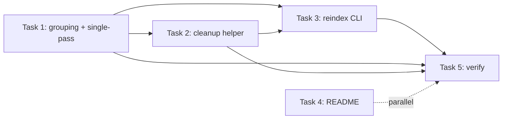

# Task Breakdown Summary — reindex-command

Source spec: `docs/specs/reindex-command.md`
Critique applied: `docs/critiques/reindex-command-critique.md` (Pass 1, PROCEED WITH UPDATES)

## Tasks

| # | Task | File(s) touched | Depends on |
|---|------|-----------------|------------|
| 1 | Full-parent-path grouping + single-pass read in `generate_index` | `src/knowledge_extractor/index.py`, `tests/test_index.py` | — |
| 2 | Content-verified `cleanup_nested_artifacts` helper | `src/knowledge_extractor/index.py`, `tests/test_index.py` | Task 1 (`_is_hidden`) |
| 3 | `reindex` CLI command | `src/knowledge_extractor/cli.py`, `tests/test_cli_reindex.py` | Tasks 1, 2 |
| 4 | README documentation | `README.md` | — |
| 5 | Full verification pass | — (runs suite) | Tasks 1–3 (ideally 4) |

## Dependency graph

## Parallelization guidance

- **Group A (sequential, one agent — same file `index.py`)**: Task 1 → Task 2. These two
  must not be edited concurrently by separate agents; they share
  `src/knowledge_extractor/index.py` and both add module-level helpers. Implement Task 1
  first (it introduces `_is_hidden`, which Task 2 reuses), then Task 2 in the same pass.
- **Group B (parallel, independent file)**: Task 4 (`README.md`) can run concurrently with
  Group A — no shared files.
- **Task 3** starts only after Group A lands (`generate_index` return signature and
  `cleanup_nested_artifacts` must exist). It touches `cli.py` + a new test file, so it
  won't conflict with Group A/B files, but it is logically dependent.
- **Task 5** runs last, after 1–3 (and 4) are merged, to verify the whole suite.

### Recommended execution

1. In parallel: **Agent 1** → Tasks 1+2 (index.py, test_index.py); **Agent 2** → Task 4
   (README.md).
2. After Agent 1 completes: **Agent 3** (or Agent 1) → Task 3 (cli.py, test_cli_reindex.py).
3. Finally: Task 5 — run `uv run pytest` and the demo commands; fix any failures.

## Key invariants from the critique (do not regress)

- Cleanup is **content-verified**: only delete nested `index.md` starting with
  `# Knowledge Index` and `manifest.json` that is a JSON array of entry dicts with
  `path`/`title`/`group`. Preserve + log everything else (P1/E1).
- `generate_index` reads each file **once** (E2) and returns `(doc_count, group_count)` (P2).
- Hidden directories (components starting with `.`) are excluded from both indexing and
  cleanup (E3).
- `input_dir` is deprecated/ignored but still positionally accepted (E4).
- Manifest entry shape and index link rendering are unchanged.
