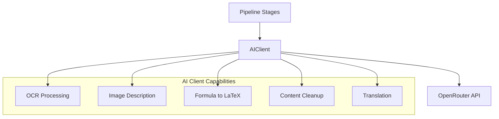

# AI Client

The AIClient is the central abstraction for all AI-powered operations in the knowledge extraction pipeline. It wraps OpenRouter as the LLM provider, providing a unified interface for the optional AI-assisted post-processing steps that enhance extracted content.

## Purpose and Scope

The AIClient serves as the interface layer between the extraction pipeline and external LLM services. Rather than having each pipeline stage manage its own API connections, retry logic, and error handling, the AIClient centralizes these concerns and exposes focused methods for each AI capability:

- **OCR** — Optical character recognition for scanned or image-based content
- **Image Description** — Generating textual descriptions of images and figures
- **Formula-to-LaTeX** — Converting detected mathematical formulas to LaTeX representation
- **Content Cleanup** — Refining and normalizing extracted text
- **Translation** — Optionally translating extracted content to a target language

## Architecture Overview

## Configuration

The AIClient is configured through runtime settings that control its behavior:

| Configuration | Description |
|---------------|-------------|
| OpenRouter API Key | Authentication credential for the OpenRouter service |
| Model Selection | Choice of LLM model for different tasks |
| Logging Setup | Diagnostic output for AI operation tracing |

See [Configuration](../operations/configuration.md) for detailed setup instructions.

## Error Handling: Retryable vs Non-Retryable

The AIClient implements a differentiated error handling strategy that distinguishes between transient failures and permanent errors.

### Retryable Errors

Retryable errors are transient conditions that may succeed on a subsequent attempt. The AIClient automatically retries these with exponential backoff:

- Network timeouts and connection failures
- Rate limiting (HTTP 429 responses)
- Server-side errors (HTTP 5xx responses)
- Temporary service unavailability

### Non-Retryable Errors

Non-retryable errors indicate problems that cannot be resolved by retrying. The AIClient fails fast for these conditions:

- Authentication failures (invalid or missing API key)
- Invalid request parameters
- Content policy violations
- Invalid model specifications
- Rate limit exhaustion beyond recovery

This distinction prevents wasted retries on permanent failures while providing resilience against transient network or service issues.

## AI Capabilities

### OCR Processing

For scanned documents or image-based PDF pages, the OCR capability extracts text content that would be unavailable through standard text extraction. This is particularly important for:

- Scanned PDFs without embedded text layers
- Image attachments in documents
- Non-selectable text in figures

### Image Description

The image description capability generates textual descriptions of images and figures found in source documents. This enriches the extracted Markdown with alt-text-like descriptions, improving accessibility and searchability.

### Formula-to-LaTeX Conversion

When mathematical formulas are detected in source documents (see [Formulas](../concepts/formulas.md)), the AIClient can convert them to LaTeX representation. This provides:

- Machine-readable mathematical notation
- Rendering compatibility with LaTeX-aware tools
- Consistent formula representation across document formats

### Content Cleanup

The cleanup capability refines extracted text by:

- Normalizing whitespace and formatting artifacts
- Removing extraction-induced noise
- Improving readability of the output Markdown

### Translation

The optional translation capability can translate extracted content to a target language. This is an opt-in feature controlled through pipeline configuration, allowing multi-language output from single-language source documents.

## Integration with Pipeline

The AIClient is invoked by the extraction [pipeline](../architecture/overview.md) at specific stages:

1. **After extraction** — Initial content is extracted from the source document
2. **Formula processing** — Detected formulas are sent for LaTeX conversion
3. **OCR rendering** — Scanned content is processed through OCR
4. **Image analysis** — Images receive textual descriptions
5. **Cleanup** — Content is refined and normalized
6. **Translation** — If enabled, content is translated

See the [Extraction Workflow](../workflows/extract-file.md) for the complete end-to-end flow.

## Relationship to Other Components

| Component | Relationship |
|-----------|--------------|
| [Pipeline](../architecture/overview.md) | Invokes AIClient for AI-assisted post-processing stages |
| [Extractors](../architecture/extractors.md) | Produce content that may be enhanced by AIClient capabilities |
| [Configuration](../operations/configuration.md) | Provides OpenRouter credentials and model selection to AIClient |
| [Formulas](../concepts/formulas.md) | Detected formulas are sent to AIClient for LaTeX conversion |
| [Extraction Workflow](../workflows/extract-file.md) | Defines when and how AIClient steps are invoked |

## Testing

Unit tests verify AIClient behavior around:

- Request chunking and batching for large content
- Translation request/response handling
- Error classification (retryable vs non-retryable)
- Integration with pipeline stages

See [Test Strategy](../testing/test-strategy.md) for coverage details.
