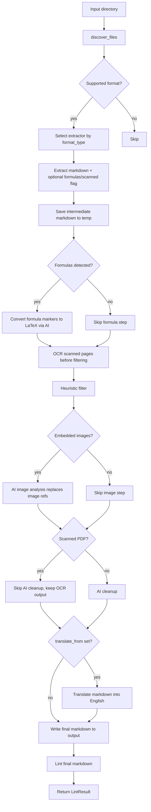

# Knowledge Extractor Architecture

The knowledge extractor (`src/knowledge_extractor`) is a Click-based CLI that walks an input directory tree, extracts structured text from supported office and image formats, enriches the result through AI-assisted post-processing, lints the final Markdown, and then rebuilds an `index.md` plus `manifest.json` in the output tree.

## Entrypoints

<!-- openwiki: broken internal link [../src/knowledge_extractor/cli.py] file "../src/knowledge_extractor/cli.py" does not exist. Fix the href or restore the target, then delete this comment. -->
The CLI is defined in [src/knowledge_extractor/cli.py](../src/knowledge_extractor/cli.py) as a Click group with a custom default-command behavior:

- `convert` (the default command) runs the extraction pipeline for a given `--input`, `--output`, `--temp`, model, and optional `--translate-from`.
- `clear` removes the `temp` directory and optionally the `output` directory.
- `lint` re-runs markdown linting on an existing output tree.
- `reindex` regenerates the root `index.md` / `manifest.json`, with an option to keep nested generated artifacts.

<!-- openwiki: broken internal link [../src/knowledge_extractor/cli.py] file "../src/knowledge_extractor/cli.py" does not exist. Fix the href or restore the target, then delete this comment. -->
Because the group is configured with `cls=_DefaultGroup` and `default_command="convert"`, invoking the CLI without a subcommand still runs `convert` as long as the first argument is not a known command or help flag [src/knowledge_extractor/cli.py](../src/knowledge_extractor/cli.py).

<!-- openwiki: broken internal link [../src/knowledge_extractor/cli.py] file "../src/knowledge_extractor/cli.py" does not exist. Fix the href or restore the target, then delete this comment. -->
`--translate-from` is validated before it is embedded into LLM prompts; control characters, including newlines, cause `click.BadParameter` [src/knowledge_extractor/cli.py](../src/knowledge_extractor/cli.py).

## File discovery

<!-- openwiki: broken internal link [../src/knowledge_extractor/discovery.py] file "../src/knowledge_extractor/discovery.py" does not exist. Fix the href or restore the target, then delete this comment. -->
Discovery is handled in [src/knowledge_extractor/discovery.py](../src/knowledge_extractor/discovery.py):

- It walks the input tree with `rglob("*")`.
- It skips directories whose path components contain `.git` (the `SKIP_DIRS` set).
- It only yields files whose lowercased suffix is in `SUPPORTED`, mapping each suffix to a `format_type`:
  - `.docx`, `.pptx`, `.xlsx`, `.pdf`, or image (`.jpg`, `.jpeg`, `.png`).

Each result is a `DiscoveredFile` with `path`, `relative_path`, and `format_type`.

## Per-format extractors

<!-- openwiki: broken internal link [../src/knowledge_extractor/pipeline.py] file "../src/knowledge_extractor/pipeline.py" does not exist. Fix the href or restore the target, then delete this comment. -->
Each format type is handled by its own extractor in [src/knowledge_extractor/extractors/](../src/knowledge_extractor/extractors/). The registry in [src/knowledge_extractor/pipeline.py](../src/knowledge_extractor/pipeline.py) maps:

- `docx` → `extract_docx`
- `pptx` → `extract_pptx`
- `xlsx` → `extract_xlsx`
- `pdf` → `extract_pdf`
- `image` → `extract_image`

<!-- openwiki: broken internal link [../src/knowledge_extractor/pipeline.py] file "../src/knowledge_extractor/pipeline.py" does not exist. Fix the href or restore the target, then delete this comment. -->
Extractors are called as `extractor(file.path, args.temp)` and return either a `str` or an `ExtractionResult`. When the result is a string, the pipeline wraps it as `ExtractionResult(markdown=result, formulas=[])` [src/knowledge_extractor/pipeline.py](../src/knowledge_extractor/pipeline.py). `ExtractionResult` carries:

- `markdown`
- `formulas`
- `is_scanned`

<!-- openwiki: broken internal link [../src/knowledge_extractor/formulas/__init__.py] file "../src/knowledge_extractor/formulas/__init__.py" does not exist. Fix the href or restore the target, then delete this comment. -->
[src/knowledge_extractor/formulas/__init__.py](../src/knowledge_extractor/formulas/__init__.py).

### docx

`extract_docx` uses `python-docx` and the document XML to:

- extract embedded images into a per-file temp image directory,
- preserve heading paragraphs as `#` / `##` / `###`,
- render tables as Markdown tables,
- detect Office Math ML (OMML) formulas and emit formula markers `<<FORMULA:n>>` in the markdown while recording `FormulaRef` entries with the raw OMML XML and context text.

<!-- openwiki: broken internal link [../src/knowledge_extractor/extractors/docx_extractor.py] file "../src/knowledge_extractor/extractors/docx_extractor.py" does not exist. Fix the href or restore the target, then delete this comment. -->
[src/knowledge_extractor/extractors/docx_extractor.py](../src/knowledge_extractor/extractors/docx_extractor.py).

### pptx

`extract_pptx` works slide by slide through `python-pptx`:

- renders each slide as `## Slide n`.
- extracts pictures and embedded tables,
- records speaker notes as a `> **Notes:**` block,
- detects OMML formulas in text frames, emitting `FormulaRef` entries and markers similarly to the DOCX path.

<!-- openwiki: broken internal link [../src/knowledge_extractor/extractors/pptx_extractor.py] file "../src/knowledge_extractor/extractors/pptx_extractor.py" does not exist. Fix the href or restore the target, then delete this comment. -->
[src/knowledge_extractor/extractors/pptx_extractor.py](../src/knowledge_extractor/extractors/pptx_extractor.py).

### xlsx

`extract_xlsx` uses `openpyxl` in read-only / data-only mode and emits one Markdown section per sheet with table-formatted rows.

<!-- openwiki: broken internal link [../src/knowledge_extractor/extractors/excel_extractor.py] file "../src/knowledge_extractor/extractors/excel_extractor.py" does not exist. Fix the href or restore the target, then delete this comment. -->
[src/knowledge_extractor/extractors/excel_extractor.py](../src/knowledge_extractor/extractors/excel_extractor.py).

### pdf

<!-- openwiki: broken internal link [../src/knowledge_extractor/extractors/pdf_extractor.py] file "../src/knowledge_extractor/extractors/pdf_extractor.py" does not exist. Fix the href or restore the target, then delete this comment. -->
PDF extraction in [src/knowledge_extractor/extractors/pdf_extractor.py](../src/knowledge_extractor/extractors/pdf_extractor.py) uses `pymupdf` and splits behavior by a scanned-document heuristic:

- A quick scan counts pages with no extractable text.
- If the scanned ratio is at least `SCANNED_THRESHOLD` (0.8), the PDF is treated as scanned and rendered to per-page images for OCR-oriented post-processing.
- Otherwise, the extractor runs a second pass that detects formula regions, renders those regions as images, and extracts embedded images (deduplicated by xref, skipping small ones).

Scanned PDFs emit `` markers for pages that have no text; text-based PDFs emit `` for embedded images and `<<FORMULA:n>>` markers for detected formula regions.

### image

`extract_image` simply copies the source image into the per-file temp image directory and emits a single `` reference.

<!-- openwiki: broken internal link [../src/knowledge_extractor/extractors/image_extractor.py] file "../src/knowledge_extractor/extractors/image_extractor.py" does not exist. Fix the href or restore the target, then delete this comment. -->
[src/knowledge_extractor/extractors/image_extractor.py](../src/knowledge_extractor/extractors/image_extractor.py).

## Post-processing pipeline

<!-- openwiki: broken internal link [../src/knowledge_extractor/pipeline.py] file "../src/knowledge_extractor/pipeline.py" does not exist. Fix the href or restore the target, then delete this comment. -->
The main per-file orchestration is in [src/knowledge_extractor/pipeline.py](../src/knowledge_extractor/pipeline.py):

1. **Extract** - call the appropriate extractor and save the intermediate markdown to the temp directory.
2. **Formulas** - if formula references/regions were detected, convert the markers to LaTeX through the AI client.
3. **OCR** - for scanned PDFs, replace `` markers with OCR-extracted text before filtering.
<!-- openwiki: broken internal link [../src/knowledge_extractor/filters.py] file "../src/knowledge_extractor/filters.py" does not exist. Fix the href or restore the target, then delete this comment. -->
4. **Filter** - apply heuristic filtering in [src/knowledge_extractor/filters.py](../src/knowledge_extractor/filters.py).
5. **AI image analysis** - replace `` references with AI-generated descriptions, including mermaid blocks when the model returns them.
6. **AI cleanup** - for non-scanned PDFs, call `AIClient.cleanup_content()`; scanned PDFs skip this step.
7. **AI translation** - if `--translate-from` was set, translate the assembled markdown into English using the configured translation model.
8. **Write final output** - write the final markdown under `output`, preserving the source-relative path but with a `.md` suffix.
9. **Markdown lint fix** - run `lint_file()` on the written output.
10. **Done** - return the `LintResult`.

<!-- openwiki: broken internal link [../src/knowledge_extractor/ai.py] file "../src/knowledge_extractor/ai.py" does not exist. Fix the href or restore the target, then delete this comment. -->
AI clients are cached per model in `_ai_clients`, and formula/OCR/image/cleanup/translation all go through `AIClient` methods in [src/knowledge_extractor/ai.py](../src/knowledge_extractor/ai.py).

### Formula conversion

<!-- openwiki: broken internal link [/openwiki/architecture/overview.md] link "/openwiki/architecture/overview.md" is root-absolute, which no real consumer resolves against the repository root (not a coding agent reading the page, not GitHub's Markdown renderer, not a local viewer); use a path relative to this file instead. Fix the href or restore the target, then delete this comment. -->
Formula markers are replaced by [`_process_formulas`](/openwiki/architecture/overview.md) using the AI client:

- `FormulaRef` (DOCX/PPTX) sends cleaned OMML XML to the model.
- `FormulaRegion` (PDF) sends the rendered formula image.
- Inline formulas are rendered as `$...$`; display/block formulas are rendered as `$$\n...\n$$`.

When the AI client is absent, formula markers become `[FORMULA: no API key]`; when conversion fails for another reason, they become `[FORMULA: conversion failed]`.

<!-- openwiki: broken internal link [../src/knowledge_extractor/pipeline.py] file "../src/knowledge_extractor/pipeline.py" does not exist. Fix the href or restore the target, then delete this comment. -->
[src/knowledge_extractor/pipeline.py](../src/knowledge_extractor/pipeline.py).

### OCR

OCR is done in `_ocr_scanned_pages()` before filtering, so that the text is present for downstream steps. It replaces `` markers with extracted text; blank pages are removed entirely, and failed images are left untouched so they are not lost.

<!-- openwiki: broken internal link [../src/knowledge_extractor/pipeline.py] file "../src/knowledge_extractor/pipeline.py" does not exist. Fix the href or restore the target, then delete this comment. -->
[src/knowledge_extractor/pipeline.py](../src/knowledge_extractor/pipeline.py).

### Filtering

<!-- openwiki: broken internal link [../src/knowledge_extractor/filters.py] file "../src/knowledge_extractor/filters.py" does not exist. Fix the href or restore the target, then delete this comment. -->
Filtering is a lightweight heuristic pass in [src/knowledge_extractor/filters.py](../src/knowledge_extractor/filters.py):

- For PPTX, it can drop title slides that are mostly images.
- It drops sections that contain only images with no text.
- It removes repeated header/footer lines that appear 3+ times across the document.

## Linting

<!-- openwiki: broken internal link [../src/knowledge_extractor/linter.py] file "../src/knowledge_extractor/linter.py" does not exist. Fix the href or restore the target, then delete this comment. -->
Linting is implemented in [src/knowledge_extractor/linter.py](../src/knowledge_extractor/linter.py):

- Files under 512 KB use the full `pymarkdownlnt` path: scan, fix, rescan.
- Larger files use a fast regex-based fixer for common rules such as trailing whitespace, tabs, multiple blank lines, heading spacing, and blank lines around headings.

The result is a `LintResult` with `fixed_count`, `remaining_failures`, and whether fast mode was used.

## Indexing

<!-- openwiki: broken internal link [../src/knowledge_extractor/index.py] file "../src/knowledge_extractor/index.py" does not exist. Fix the href or restore the target, then delete this comment. -->
Index generation is in [src/knowledge_extractor/index.py](../src/knowledge_extractor/index.py):

- It scans the output tree for non-hidden `*.md` files except the root `index.md`.
- It groups documents by their full relative parent path, with root-level files grouped under `"Root"`.
- It reads each Markdown file once and extracts:
  - title (first `# ` heading within the first 20 lines, else the file stem),
  - headings (up to 20 of the first level 1–3 headings),
  - word count.
- It writes:
  - `index.md` with a `# Knowledge Index` header and grouped links,
  - `manifest.json` with per-document metadata.

The pipeline calls `generate_index()` at the end of a successful run, after which it logs per-model AI usage summaries.

`cleanup_nested_artifacts()` can remove generated `index.md` / `manifest.json` files from subdirectories when `reindex` is run without `--keep-nested`. It only removes artifacts that look like extractor-generated files (by content signature), preserves user content, and never touches hidden directories.

<!-- openwiki: broken internal link [../src/knowledge_extractor/index.py] file "../src/knowledge_extractor/index.py" does not exist. Fix the href or restore the target, then delete this comment. -->
[src/knowledge_extractor/index.py](../src/knowledge_extractor/index.py).

## Runtime flow

The overall per-file lifecycle is illustrated below.

## Dependencies and notable boundaries

- The CLI owns orchestration and user-facing defaults; extractors own format-specific parsing; the pipeline owns ordering and shared AI post-processing.
<!-- openwiki: broken internal link [../src/knowledge_extractor/pipeline.py] file "../src/knowledge_extractor/pipeline.py" does not exist. Fix the href or restore the target, then delete this comment. -->
<!-- openwiki: broken internal link [../src/knowledge_extractor/ai.py] file "../src/knowledge_extractor/ai.py" does not exist. Fix the href or restore the target, then delete this comment. -->
- AI behavior is optional: missing `OPENROUTER_API_KEY` or transient provider errors cause individual AI steps to be skipped rather than failing the whole run, though a configured but unresponsive provider aborts processing [src/knowledge_extractor/pipeline.py](../src/knowledge_extractor/pipeline.py) and [src/knowledge_extractor/ai.py](../src/knowledge_extractor/ai.py).
- Indexing is decoupled from extraction: `reindex` exists specifically for regenerating the index without re-extracting or re-AIsing content.

## Related pages

- [AI Client](../architecture/ai-client.md) - the AI client interface, prompts, and failure/retry semantics.
- [Extractors](../architecture/extractors.md) - deeper coverage of per-format extraction and formula/OCR handling.
- [Extract File Workflow](../workflows/extract-file.md) - end-to-end file processing steps.
- [Quickstart](../quickstart.md) - running the CLI.
