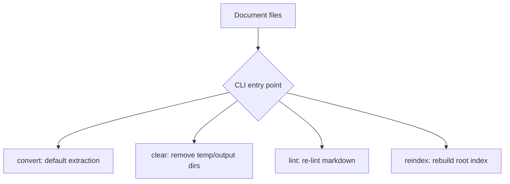

# Quickstart

This page routes new readers to the right deep-dive page for each concern. Start here if you are setting up the project, running your first extraction, or trying to understand which component handles a given document feature.

## What this project does

**Knowledge Extractor** turns document file trees into clean Markdown that agents can read. It supports Word, PowerPoint, Excel, PDF, and images, and enriches the output with AI-assisted steps when an OpenRouter API key is available.



## Routing map

| I want to… | Go to |
|---|---|
<!-- openwiki: broken internal link [../architecture/overview.md] file "../architecture/overview.md" does not exist. Fix the href or restore the target, then delete this comment. -->
| Understand the overall architecture, components, and data flow | [Architecture Overview](../architecture/overview.md) |
<!-- openwiki: broken internal link [../operations/cli-reference.md] file "../operations/cli-reference.md" does not exist. Fix the href or restore the target, then delete this comment. -->
| Run the tool for the first time and understand the CLI surface | [CLI Reference](../operations/cli-reference.md) |
<!-- openwiki: broken internal link [../operations/configuration.md] file "../operations/configuration.md" does not exist. Fix the href or restore the target, then delete this comment. -->
| Configure the API key, models, logging, temp/output layout, and linting | [Configuration](../operations/configuration.md) |
<!-- openwiki: broken internal link [../workflows/extract-file.md] file "../workflows/extract-file.md" does not exist. Fix the href or restore the target, then delete this comment. -->
| Follow what happens to a single file, end to end | [Extraction Workflow](../workflows/extract-file.md) |
<!-- openwiki: broken internal link [../concepts/formulas.md] file "../concepts/formulas.md" does not exist. Fix the href or restore the target, then delete this comment. -->
| Learn how formulas are detected and converted to LaTeX | [Formulas](../concepts/formulas.md) |
<!-- openwiki: broken internal link [../workflows/extract-file.md] file "../workflows/extract-file.md" does not exist. Fix the href or restore the target, then delete this comment. -->
<!-- openwiki: broken internal link [../architecture/extractors.md] file "../architecture/extractors.md" does not exist. Fix the href or restore the target, then delete this comment. -->
| Understand how scanned PDFs and OCR work | [Extraction Workflow](../workflows/extract-file.md) and [Document Extractors](../architecture/extractors.md) |
<!-- openwiki: broken internal link [../architecture/ai-client.md] file "../architecture/ai-client.md" does not exist. Fix the href or restore the target, then delete this comment. -->
| See what AI image analysis, cleanup, and translation do | [AI Client](../architecture/ai-client.md) |
<!-- openwiki: broken internal link [../operations/output-and-index.md] file "../operations/output-and-index.md" does not exist. Fix the href or restore the target, then delete this comment. -->
| Understand the output Markdown, index.md, and manifest.json | [Output and Index](../operations/output-and-index.md) |
<!-- openwiki: broken internal link [../operations/output-and-index.md] file "../operations/output-and-index.md" does not exist. Fix the href or restore the target, then delete this comment. -->
| Learn how joining multiple vaults works | [Output and Index](../operations/output-and-index.md) |
<!-- openwiki: broken internal link [../testing/test-strategy.md] file "../testing/test-strategy.md" does not exist. Fix the href or restore the target, then delete this comment. -->
| Understand the test layout and what is covered | [Test Strategy](../testing/test-strategy.md) |

## First run

The fastest path to a working extraction:

```bash
uv sync
cp .env.example .env   # add your OpenRouter API key
uv run convert --input ./input --output ./output --temp ./temp --model google/gemini-2.5-flash
```

Equivalently, using the command group or `main.py`:

```bash
uv run knowledge-extractor convert --input ./input --output ./output
uv run python main.py --input ./input --output ./output   # subcommand optional; defaults to `convert`
```

`main.py` is a thin wrapper: it inserts `src/` on `sys.path` and calls `knowledge_extractor.cli:main()`.

If you invoke the CLI with no subcommand, extraction still runs. The `cli` group uses `_DefaultGroup`, which forwards unknown first arguments to the default command (`convert`) instead of treating them as unknown subcommands. Flags like `--input ./in` are therefore valid without an explicit subcommand.

## Pipeline at a glance

Each file goes through a fixed sequence. The pipeline lives in `knowledge_extractor.pipeline:process_file`.

<!-- openwiki: mermaid parse failed and this diagram was converted to a text fence so it does not break rendering. Fix the diagram source and restore the mermaid fence. Parser error: Heuristic: an unescaped angle bracket inside a label breaks rendering; rephrase the label. -->
```text
sequenceDiagram
    participant CLI as CLI
    participant Pipeline as process_file
    participant Extractor as Extractor
    participant AI as AIClient
    participant Linter as Linter
    participant Index as generate_index

    CLI->>Pipeline: process_file(file, args, log)
    Pipeline->>Extractor: extract(file.path, temp)
    Extractor-->>Pipeline: markdown + formulas
    Pipeline->>Pipeline: save intermediate markdown to temp
    Pipeline->>AI: process formulas (OMML or image -> LaTeX)
    Pipeline->>AI: OCR scanned pages (![ocr]... markers)
    Pipeline->>Pipeline: heuristic filter (remove title slides, logos, repeated headers)
    Pipeline->>AI: describe images (![image]... markers)
    Pipeline->>AI: cleanup_content (chunked for large docs)
    Pipeline->>AI: translate_content (if --translate-from)
    Pipeline->>Pipeline: write final markdown to output
    Pipeline->>Linter: lint_file(out_path)
    Linter-->>Pipeline: LintResult(fixed_count, remaining)
    Pipeline->>Index: generate_index(output, input, log)
```

Steps in prose:
1. **Extract** — run the per-format extractor (`docx`, `pptx`, `xlsx`, `pdf`, or `image`), producing Markdown with embedded image and formula markers.
2. **Formula processing** — convert formula markers to LaTeX via AI vision (PDF formula images) or OMML-to-LaTeX (DOCX/PPTX). Without an API key, placeholders are inserted.
3. **OCR scanned pages** — replace `` markers with text extracted from scanned page images. This happens before filtering so the text is present for later steps.
4. **Heuristic filtering** — remove title slides, logo-only sections, and repeated headers.
5. **AI image analysis** — replace `` markers with Mermaid diagrams, chart descriptions, or Figure: descriptions.
6. **AI cleanup** — clean up the assembled Markdown, chunked for large documents. Skipped for scanned PDFs, since OCR already produces clean text.
7. **AI translation (optional)** — if `--translate-from` is set, translate the assembled Markdown into English after cleanup and before linting.
8. **Write output** — write the final Markdown to `output/`.
9. **Lint** — auto-fix formatting issues with `pymarkdownlnt`.
10. **Index** — regenerate `index.md` and `manifest.json` at the output root.

## AI steps and when they are skipped

AI steps depend on `OPENROUTER_API_KEY`. If the key is not set, `AIClient.client` is `None` and AI methods return `None` or skip. The pipeline handles this gracefully:

- Formulas: placeholders (`[FORMULA: conversion failed]` or `[FORMULA: no API key]`) are inserted instead of LaTeX.
- OCR: `![ocr]` markers are kept (so image references are not lost) when AI is unavailable.
- Image analysis: original `![image]` markers are kept when AI is unavailable.
- Cleanup and translation: skipped when AI is unavailable, with a log note.

<!-- openwiki: broken internal link [../architecture/ai-client.md] file "../architecture/ai-client.md" does not exist. Fix the href or restore the target, then delete this comment. -->
The AI client is documented in [AI Client](../architecture/ai-client.md). Two error classes are worth knowing:

- `AIBadRequestError` — a 400-level bad request (non-retryable, e.g. malformed prompt or image).
- `AIProviderError` — the provider failed after all retries (raised in `cli._run`, which aborts the batch).

The AI client's `_call` method retries transient failures with exponential backoff (2, 4, 8, 16s) and distinguishes retryable from non-retryable status codes (400, 401, 403, 404 are not retried).

## Incremental processing

The CLI skips a source file if its output Markdown already exists. This is checked in `cli._run` before the per-file loop, and `process_file` is only called for pending files. To force re-processing, delete the output file or the output directory, or run `clear`.

When `--translate-from` is set and some outputs already exist, a warning is logged because existing outputs are not re-translated. Delete the outputs or run `clear` to re-translate.

The `dry-run` flag lists which files would be processed and which would be skipped, then exits without processing.

## Configuration

<!-- openwiki: broken internal link [../operations/configuration.md] file "../operations/configuration.md" does not exist. Fix the href or restore the target, then delete this comment. -->
Configuration is documented in [Configuration](../operations/configuration.md). The essentials:

- `OPENROUTER_API_KEY` — required for AI steps. If unset, AI steps are skipped and raw extractions are output.
- `--model` — OpenRouter vision model for image analysis, OCR, formulas, and cleanup. Default in code is `DEFAULT_MODEL = "openai/gpt-6-luna"`. README currently shows `google/gemini-2.5-flash` as the example.
- `--translate-model` — model used for translation. Default in code is `DEFAULT_TRANSLATE_MODEL = "mistralai/mistral-large-2512"`. Falls back to `--model` if unset.
- `--translate-from` — source language for translation to English. Sanitized before use to reject newlines and control characters (defense against prompt injection via the flag value, spec finding P3).
- `--dry-run` — list files to process/skip and exit.

## Output

<!-- openwiki: broken internal link [../operations/output-and-index.md] file "../operations/output-and-index.md" does not exist. Fix the href or restore the target, then delete this comment. -->
Output is documented in [Output and Index](../operations/output-and-index.md). The contract is:

- `output/index.md` — flat index grouped by original folder structure.
- `output/**/*.md` — one Markdown file per source document.
- `output/extraction.log` — logging output.

The `reindex` command rebuilds the root `index.md` + `manifest.json` from Markdown already on disk, with no extraction, no AI, and no linting. This is the workflow for joining vaults: copy the per-document subfolders of several output directories into one combined directory, then run `reindex`.

```bash
uv run knowledge-extractor reindex ./output
uv run knowledge-extractor reindex ./output --keep-nested
```

By default, `reindex` removes nested `index.md`/`manifest.json` files found in subdirectories, but only when they are verified extractor-generated artifacts (a nested `index.md` must start with `# Knowledge Index`; a nested `manifest.json` must be a JSON array of entries carrying `path`/`title`/`group`). User-content `index.md` files are preserved and logged. Files inside hidden directories (any path component starting with `.`) are neither indexed nor removed.

## Supported formats

- `.docx` — Word
- `.pptx` — PowerPoint
- `.xlsx` — Excel
- `.pdf` — PDF (including scanned/image-only PDFs with OCR)
- `.jpg`, `.jpeg`, `.png` — images

File discovery is in `knowledge_extractor.discovery:discover_files`. It recursively scans the input directory, skips `.git` directories, and maps supported extensions to format types.

## Subcommands beyond convert

| Subcommand | What it does |
|---|---|
| `convert` (default) | Extract knowledge from the input directory |
| `clear` | Remove temp directory (or output too with `--all`) |
| `lint` | Re-lint all Markdown files in a directory |
| `reindex` | Rebuild root index.md/manifest.json across all subfolders |

`clear` prompts before removing directories. `lint` resolves the directory, walks `rglob("*.md")`, and reports per-file fix counts. `reindex` takes a required positional directory argument (consistent with `lint`).

## Scripts and entry points

`pyproject.toml` registers two scripts:

- `knowledge-extractor = "knowledge_extractor.cli:main"` — the command group.
- `convert = "knowledge_extractor.cli:convert_main"` — a shortcut that calls `convert()` directly, enabling `uv run convert --input ./in`.

`convert_main` exists so you can run `uv run convert` without typing the subcommand.

## Where to go next

<!-- openwiki: broken internal link [../operations/configuration.md] file "../operations/configuration.md" does not exist. Fix the href or restore the target, then delete this comment. -->
<!-- openwiki: broken internal link [../operations/cli-reference.md] file "../operations/cli-reference.md" does not exist. Fix the href or restore the target, then delete this comment. -->
<!-- openwiki: broken internal link [../workflows/extract-file.md] file "../workflows/extract-file.md" does not exist. Fix the href or restore the target, then delete this comment. -->
<!-- openwiki: broken internal link [../concepts/formulas.md] file "../concepts/formulas.md" does not exist. Fix the href or restore the target, then delete this comment. -->
<!-- openwiki: broken internal link [../architecture/ai-client.md] file "../architecture/ai-client.md" does not exist. Fix the href or restore the target, then delete this comment. -->
<!-- openwiki: broken internal link [../operations/output-and-index.md] file "../operations/output-and-index.md" does not exist. Fix the href or restore the target, then delete this comment. -->
If you are setting up the project, read [Configuration](../operations/configuration.md) next. If you are running extraction, read [CLI Reference](../operations/cli-reference.md) and [Extraction Workflow](../workflows/extract-file.md). If you care about formulas or OCR, read [Formulas](../concepts/formulas.md) and [AI Client](../architecture/ai-client.md). If you are joining vaults, read [Output and Index](../operations/output-and-index.md).
