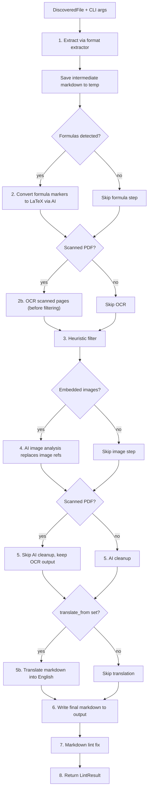

# Extract File Workflow

<!-- openwiki: broken internal link [../src/knowledge_extractor/pipeline.py] file "../src/knowledge_extractor/pipeline.py" does not exist. Fix the href or restore the target, then delete this comment. -->
This page describes the per-file processing pipeline that `knowledge-extractor` runs for each supported source file. The workflow is implemented in [src/knowledge_extractor/pipeline.py](../src/knowledge_extractor/pipeline.py) and is the primary integration point between extraction, AI-assisted post-processing, linting, and indexing.

## Overview

The pipeline is a sequential, stage-gated process. Each stage transforms the intermediate markdown or metadata before handing off to the next stage. AI steps are optional and degrade gracefully when the API key is missing or the provider fails, but a configured provider that is completely unresponsive still aborts processing.

Each stage is logged with timings, and the pipeline returns a `LintResult` at the end.

## Input and dispatch

<!-- openwiki: broken internal link [../src/knowledge_extractor/discovery.py] file "../src/knowledge_extractor/discovery.py" does not exist. Fix the href or restore the target, then delete this comment. -->
The pipeline receives a `DiscoveredFile` plus CLI args. Discovery is handled separately by [src/knowledge_extractor/discovery.py](../src/knowledge_extractor/discovery.py), which yields files whose lowercased suffix is in the supported set and skips `.git`-containing directories.

<!-- openwiki: broken internal link [../src/knowledge_extractor/pipeline.py] file "../src/knowledge_extractor/pipeline.py" does not exist. Fix the href or restore the target, then delete this comment. -->
Dispatch uses the extractor registry in [src/knowledge_extractor/pipeline.py](../src/knowledge_extractor/pipeline.py):

- `docx` → `extract_docx`
- `pptx` → `extract_pptx`
- `xlsx` → `extract_xlsx`
- `pdf` → `extract_pdf`
- `image` → `extract_image`

See [Document Extractors](../architecture/extractors.md) for deeper coverage of each format.

## Stage 1 — Extract

The appropriate extractor is called with `extractor(file.path, args.temp)`.

<!-- openwiki: broken internal link [../src/knowledge_extractor/pipeline.py] file "../src/knowledge_extractor/pipeline.py" does not exist. Fix the href or restore the target, then delete this comment. -->
<!-- openwiki: broken internal link [../src/knowledge_extractor/formulas/__init__.py] file "../src/knowledge_extractor/formulas/__init__.py" does not exist. Fix the href or restore the target, then delete this comment. -->
Extractors return either a `str` or an `ExtractionResult`. When the result is a string, the pipeline wraps it as `ExtractionResult(markdown=result, formulas=[])` [src/knowledge_extractor/pipeline.py](../src/knowledge_extractor/pipeline.py). `ExtractionResult` is defined in [src/knowledge_extractor/formulas/__init__.py](../src/knowledge_extractor/formulas/__init__.py) and carries:

- `markdown`
- `formulas`
- `is_scanned`

<!-- openwiki: broken internal link [../src/knowledge_extractor/pipeline.py] file "../src/knowledge_extractor/pipeline.py" does not exist. Fix the href or restore the target, then delete this comment. -->
The intermediate markdown is saved to `args.temp / file.relative_path.with_suffix(".md")` before any AI post-processing [src/knowledge_extractor/pipeline.py](../src/knowledge_extractor/pipeline.py). This lets the temp directory serve as a debug artifact for the raw extraction.

## Stage 2 — Formula processing

<!-- openwiki: broken internal link [../src/knowledge_extractor/pipeline.py] file "../src/knowledge_extractor/pipeline.py" does not exist. Fix the href or restore the target, then delete this comment. -->
If `extraction.formulas` is non-empty, the pipeline converts formula markers to LaTeX through the AI client [src/knowledge_extractor/pipeline.py](../src/knowledge_extractor/pipeline.py).

Formula markers are placeholders such as `<<FORMULA:n>>` that extractors emit when they detect Office Math ML (DOCX/PPTX) or rendered formula regions (PDF). The actual conversion is split by formula kind:

<!-- openwiki: broken internal link [../src/knowledge_extractor/pipeline.py] file "../src/knowledge_extractor/pipeline.py" does not exist. Fix the href or restore the target, then delete this comment. -->
<!-- openwiki: broken internal link [../src/knowledge_extractor/ai.py] file "../src/knowledge_extractor/ai.py" does not exist. Fix the href or restore the target, then delete this comment. -->
- `FormulaRef` (DOCX/PPTX) sends cleaned OMML XML to the model [src/knowledge_extractor/pipeline.py](../src/knowledge_extractor/pipeline.py) and [src/knowledge_extractor/ai.py](../src/knowledge_extractor/ai.py).
<!-- openwiki: broken internal link [../src/knowledge_extractor/pipeline.py] file "../src/knowledge_extractor/pipeline.py" does not exist. Fix the href or restore the target, then delete this comment. -->
<!-- openwiki: broken internal link [../src/knowledge_extractor/ai.py] file "../src/knowledge_extractor/ai.py" does not exist. Fix the href or restore the target, then delete this comment. -->
- `FormulaRegion` (PDF) sends the cropped formula image [src/knowledge_extractor/pipeline.py](../src/knowledge_extractor/pipeline.py) and [src/knowledge_extractor/ai.py](../src/knowledge_extractor/ai.py).

<!-- openwiki: broken internal link [../src/knowledge_extractor/pipeline.py] file "../src/knowledge_extractor/pipeline.py" does not exist. Fix the href or restore the target, then delete this comment. -->
Inline formulas are wrapped as `$...$`; display/block formulas are wrapped as `$$\n...\n$$` [src/knowledge_extractor/pipeline.py](../src/knowledge_extractor/pipeline.py).

<!-- openwiki: broken internal link [../src/knowledge_extractor/pipeline.py] file "../src/knowledge_extractor/pipeline.py" does not exist. Fix the href or restore the target, then delete this comment. -->
When the AI client is absent, formula markers become `[FORMULA: no API key]`; when conversion fails for another reason, they become `[FORMULA: conversion failed]` [src/knowledge_extractor/pipeline.py](../src/knowledge_extractor/pipeline.py).

Formula conversion is documented in more detail in [Formulas Concept](../concepts/formulas.md).

## Stage 2b — OCR scanned pages

<!-- openwiki: broken internal link [../src/knowledge_extractor/pipeline.py] file "../src/knowledge_extractor/pipeline.py" does not exist. Fix the href or restore the target, then delete this comment. -->
For scanned PDFs, the pipeline replaces `` markers with OCR-extracted text **before filtering**, so text is present for downstream steps [src/knowledge_extractor/pipeline.py](../src/knowledge_extractor/pipeline.py).

The OCR step:

- calls `ai.ocr_page()` for each marker image,
- replaces the marker with the extracted text,
- removes blank pages entirely,
<!-- openwiki: broken internal link [../src/knowledge_extractor/pipeline.py] file "../src/knowledge_extractor/pipeline.py" does not exist. Fix the href or restore the target, then delete this comment. -->
- leaves failed images untouched so they are not lost [src/knowledge_extractor/pipeline.py](../src/knowledge_extractor/pipeline.py).

This ordering matters: filtering happens after OCR, so heuristic text-based filtering can see the extracted text.

## Stage 3 — Heuristic filter

<!-- openwiki: broken internal link [../src/knowledge_extractor/filters.py] file "../src/knowledge_extractor/filters.py" does not exist. Fix the href or restore the target, then delete this comment. -->
Filtering is a lightweight heuristic pass in [src/knowledge_extractor/filters.py](../src/knowledge_extractor/filters.py).

Current behavior:

- For PPTX, title slides that are mostly images can be dropped.
- Sections that contain only images with no text are dropped.
<!-- openwiki: broken internal link [../src/knowledge_extractor/filters.py] file "../src/knowledge_extractor/filters.py" does not exist. Fix the href or restore the target, then delete this comment. -->
- Repeated header/footer lines that appear 3+ times across the document are removed [src/knowledge_extractor/filters.py](../src/knowledge_extractor/filters.py).

Filtering is intentionally lightweight. It is not a full semantic filter; it targets common extraction noise.

## Stage 4 — AI image analysis

<!-- openwiki: broken internal link [../src/knowledge_extractor/pipeline.py] file "../src/knowledge_extractor/pipeline.py" does not exist. Fix the href or restore the target, then delete this comment. -->
After filtering, the pipeline replaces `` references with AI-generated descriptions [src/knowledge_extractor/pipeline.py](../src/knowledge_extractor/pipeline.py).

The image analysis step:

- counts image references,
- for each image, captures surrounding text as context (limited to a window around the reference, with other image refs stripped),
- calls `ai.describe_image()`,
- if the response starts with a fenced mermaid block, keeps the block as-is,
<!-- openwiki: broken internal link [../src/knowledge_extractor/ai.py] file "../src/knowledge_extractor/ai.py" does not exist. Fix the href or restore the target, then delete this comment. -->
<!-- openwiki: broken internal link [../src/knowledge_extractor/pipeline.py] file "../src/knowledge_extractor/pipeline.py" does not exist. Fix the href or restore the target, then delete this comment. -->
- otherwise wraps textual descriptions with a `Figure:` prefix [src/knowledge_extractor/ai.py](../src/knowledge_extractor/ai.py) and [src/knowledge_extractor/pipeline.py](../src/knowledge_extractor/pipeline.py).

If AI is unavailable for a given image, the original reference is kept.

## Stage 5 — AI cleanup

<!-- openwiki: broken internal link [../src/knowledge_extractor/pipeline.py] file "../src/knowledge_extractor/pipeline.py" does not exist. Fix the href or restore the target, then delete this comment. -->
For non-scanned PDFs, the pipeline calls `AIClient.cleanup_content()` [src/knowledge_extractor/pipeline.py](../src/knowledge_extractor/pipeline.py).

<!-- openwiki: broken internal link [../src/knowledge_extractor/pipeline.py] file "../src/knowledge_extractor/pipeline.py" does not exist. Fix the href or restore the target, then delete this comment. -->
Scanned PDFs skip this step because OCR output is already clean text and the cleanup step is unnecessary for already-OCR'd content [src/knowledge_extractor/pipeline.py](../src/knowledge_extractor/pipeline.py).

Cleanup behavior:

- returns `None` when the client is absent,
- returns the text unchanged when it is very short,
- otherwise processes the markdown through the cleanup prompt,
<!-- openwiki: broken internal link [../src/knowledge_extractor/ai.py] file "../src/knowledge_extractor/ai.py" does not exist. Fix the href or restore the target, then delete this comment. -->
- for large documents, splits on section boundaries and processes chunks [src/knowledge_extractor/ai.py](../src/knowledge_extractor/ai.py).

## Stage 5b — AI translation (optional)

<!-- openwiki: broken internal link [../src/knowledge_extractor/pipeline.py] file "../src/knowledge_extractor/pipeline.py" does not exist. Fix the href or restore the target, then delete this comment. -->
If `--translate-from` was set, the pipeline translates the assembled markdown into English [src/knowledge_extractor/pipeline.py](../src/knowledge_extractor/pipeline.py).

Translation behavior:

- uses `--translate-model` (defaults separately in the CLI), falling back to `--model` if unset,
- preserves code blocks, LaTeX, tables, URLs, and Mermaid structure,
- requires an API key; without one, translation is skipped and the original content is kept,
<!-- openwiki: broken internal link [../src/knowledge_extractor/ai.py] file "../src/knowledge_extractor/ai.py" does not exist. Fix the href or restore the target, then delete this comment. -->
- splits large documents on section boundaries like cleanup [src/knowledge_extractor/ai.py](../src/knowledge_extractor/ai.py).

Translation is subject to incremental skip: pre-existing outputs are not re-translated. When files are skipped while `--translate-from` is set, a warning is logged [openwiki/operations/cli-reference.md](../operations/cli-reference.md).

## Stage 6 — Write final output

<!-- openwiki: broken internal link [../src/knowledge_extractor/pipeline.py] file "../src/knowledge_extractor/pipeline.py" does not exist. Fix the href or restore the target, then delete this comment. -->
The processed markdown is written to `args.output / file.relative_path.with_suffix(".md")` [src/knowledge_extractor/pipeline.py](../src/knowledge_extractor/pipeline.py).

The output directory mirrors the source-relative path structure but uses `.md` as the suffix.

## Stage 7 — Markdown lint fix

<!-- openwiki: broken internal link [../src/knowledge_extractor/pipeline.py] file "../src/knowledge_extractor/pipeline.py" does not exist. Fix the href or restore the target, then delete this comment. -->
After writing, the pipeline runs `lint_file()` on the output path [src/knowledge_extractor/pipeline.py](../src/knowledge_extractor/pipeline.py).

Linting behavior:

- files under 512 KB use the full linting path,
- larger files use a fast regex-based fixer for common rules [openwiki/operations/cli-reference.md](../operations/cli-reference.md).

The result is a `LintResult` with `fixed_count`, `remaining_failures`, and whether fast mode was used.

## Stage 8 — Return

<!-- openwiki: broken internal link [../src/knowledge_extractor/pipeline.py] file "../src/knowledge_extractor/pipeline.py" does not exist. Fix the href or restore the target, then delete this comment. -->
The pipeline returns the `LintResult` and logs total elapsed time [src/knowledge_extractor/pipeline.py](../src/knowledge_extractor/pipeline.py).

## AI client caching

<!-- openwiki: broken internal link [../src/knowledge_extractor/pipeline.py] file "../src/knowledge_extractor/pipeline.py" does not exist. Fix the href or restore the target, then delete this comment. -->
AI clients are cached per model in `_ai_clients` so the same model instance is reused across formula, OCR, image, cleanup, and translation steps [src/knowledge_extractor/pipeline.py](../src/knowledge_extractor/pipeline.py). The wrapper methods `get_ai_client()` and `get_ai_clients()` expose the cached instances for summary reporting.

## Failure and skip semantics

- Missing `OPENROUTER_API_KEY` causes individual AI steps to be skipped rather than failing the whole run.
<!-- openwiki: broken internal link [../src/knowledge_extractor/ai.py] file "../src/knowledge_extractor/ai.py" does not exist. Fix the href or restore the target, then delete this comment. -->
- Transient provider errors are retried with exponential backoff in `AIClient._call()` [src/knowledge_extractor/ai.py](../src/knowledge_extractor/ai.py).
<!-- openwiki: broken internal link [../src/knowledge_extractor/pipeline.py] file "../src/knowledge_extractor/pipeline.py" does not exist. Fix the href or restore the target, then delete this comment. -->
- A configured but unresponsive provider aborts processing [src/knowledge_extractor/pipeline.py](../src/knowledge_extractor/pipeline.py).
- Per-file failures are caught, logged with traceback, and the pipeline continues; the failed count appears in the final summary [openwiki/operations/cli-reference.md](../operations/cli-reference.md).

## Relationship to other components

| Component | Relationship |
|-----------|--------------|
| [AI Client](../architecture/ai-client.md) | Provides OCR, image description, formula conversion, cleanup, and translation |
| [Document Extractors](../architecture/extractors.md) | Produce the initial markdown, formula markers, and scanned flag |
<!-- openwiki: broken internal link [../src/knowledge_extractor/filters.py] file "../src/knowledge_extractor/filters.py" does not exist. Fix the href or restore the target, then delete this comment. -->
| [Filtering](../src/knowledge_extractor/filters.py) | Lightweight heuristic post-extraction filtering |
| [CLI Reference](../operations/cli-reference.md) | User-facing flags that control this workflow, including `--translate-from` |
| [Knowledge Extractor Architecture](../architecture/overview.md) | Broader context: entrypoints, discovery, indexing, runtime flow |

## See also

- [AI Client](../architecture/ai-client.md)
- [Document Extractors](../architecture/extractors.md)
- [Formulas Concept](../concepts/formulas.md)
- [Knowledge Extractor Architecture](../architecture/overview.md)
- [CLI Reference](../operations/cli-reference.md)
